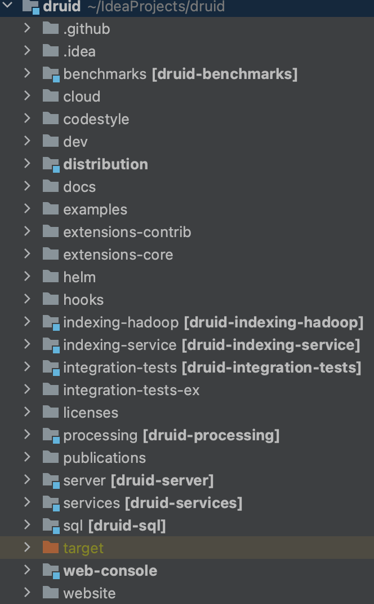
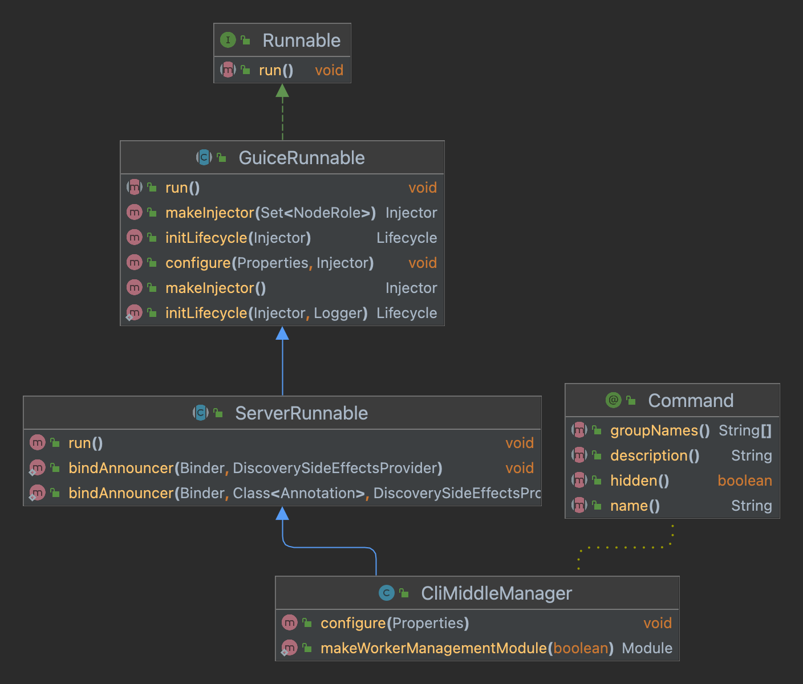
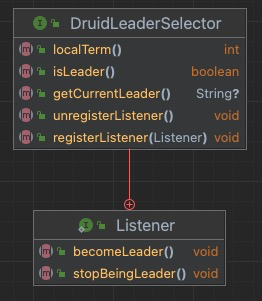
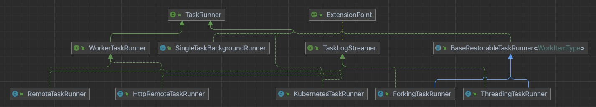
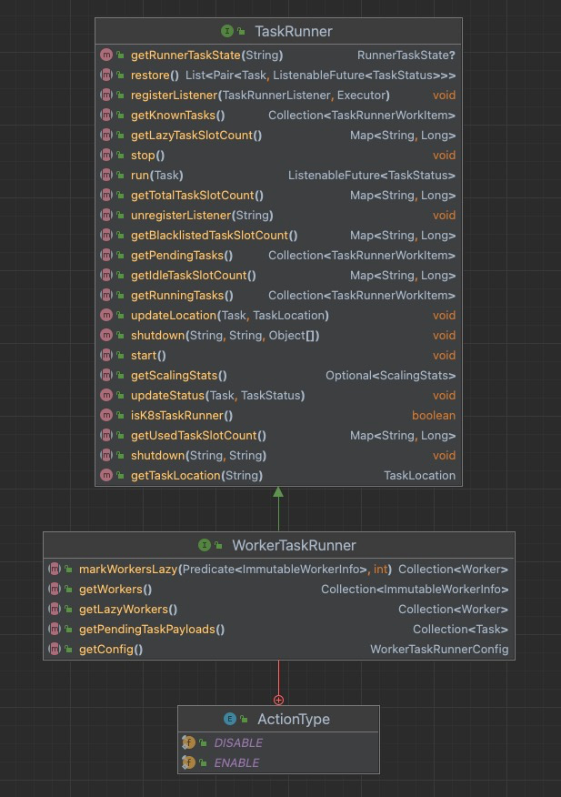

# Druid源码分析

[toc]

目录结构：



## Service启动

解析命令行使用 `Airline`，通过命令行参数构建 `Runnable` 对象，调用 `run()` 启动服务

```java
public class Main
{
  public static void main(String[] args)
  {
    //解析命令行
    final Runnable command = cli.parse(args);
    if (!(command instanceof Help)) { // Hack to work around Help not liking being injected
      //注入command对象
      injector.injectMembers(command);
    }
    //启动进程
    command.run();
  }
}
```

服务启动使用了模板设计模式



调用`ServerRunnable`的`run()`方法启动对应的服务。

```java
public abstract class ServerRunnable extends GuiceRunnable
{
  @Override
  public void run()
  {
    final Injector injector = makeInjector(getNodeRoles(getProperties()));
    //从injector里拿装载的Lifecyle
    final Lifecycle lifecycle = initLifecycle(injector);

    try {
      //等待线程运行结束
      lifecycle.join();
    }
    catch (Exception e) {
      throw new RuntimeException(e);
    }
  }
}
```

通过 `injector` 拿到 `Lifecycle` 对象，调用 `start()` 方法，启动服务

```java
public abstract class GuiceRunnable implements Runnable
{
  //子类中实现，该方法用于bind对象
  protected abstract List<? extends Module> getModules();
  
  //创建Injector，注入依赖，如CuratorModule、FirehoseModule等
  public Injector makeInjector(Set<NodeRole> nodeRoles)
  {
    try {
      return ServerInjectorBuilder.makeServerInjector(baseInjector, nodeRoles, getModules());
    }
    catch (Exception e) {
      throw new RuntimeException(e);
    }
  }
  
  public static Lifecycle initLifecycle(Injector injector, Logger log)
  {
    try {
      final Lifecycle lifecycle = injector.getInstance(Lifecycle.class);
      final StartupLoggingConfig startupLoggingConfig = injector.getInstance(StartupLoggingConfig.class);

      Long directSizeBytes = null;
      try {
        directSizeBytes = JvmUtils.getRuntimeInfo().getDirectMemorySizeBytes();
      }
      catch (UnsupportedOperationException ignore) {
        // querying direct memory is not supported
      }

      log.info(
          "Starting up with processors [%,d], memory [%,d], maxMemory [%,d]%s. Properties follow.",
          JvmUtils.getRuntimeInfo().getAvailableProcessors(),
          JvmUtils.getRuntimeInfo().getTotalHeapSizeBytes(),
          JvmUtils.getRuntimeInfo().getMaxHeapSizeBytes(),
          directSizeBytes != null ? StringUtils.format(", directMemory [%,d]", directSizeBytes) : ""
      );

      try {
        //启动进程
        lifecycle.start();
      }
      catch (Throwable t) {
        log.error(t, "Error when starting up.  Failing.");
        System.exit(1);
      }

      return lifecycle;
    }
    catch (Exception e) {
      throw new RuntimeException(e);
    }
  }
}
```

### Service生命周期

`Druid` 服务的生命周期抽象成 `Lifecycle` 类，包含4个 `Stage`：

- `INIT`：主要用于 `log4j` 的初始化；
- `NORMAL`：大多数对象的初始化都在这个阶段；
- `SERVER`：启动 `jetty` 服务器；
- `ANNOUNCEMENTS`：上述阶段完成后，会进入此状态，表示服务可用，通知整个集群

```java
public class Lifecycle
{
  private final Lock startStopLock = new ReentrantLock();
  
  private final NavigableMap<Stage, CopyOnWriteArrayList<Handler>> handlers;
  
  //保证当前状态的可见性
  private final AtomicReference<State> state = new AtomicReference<>(State.NOT_STARTED);
  
  private Stage currStage = null;
  
  public enum Stage
  {
    INIT,  //专门用于log4j的初始化
    NORMAL, //对大部分对象的配置，如zkClient，MetadataConnector的初始化
    SERVER, //适用于所有服务器对象
    ANNOUNCEMENTS //向集群宣告
  }
  
  private enum State
  {
    NOT_STARTED, //start()调用前
    RUNNING,  //start()调用后，stop()调用前
    STOP  //stop()调用后
  }
  
  //主要在NORMAL阶段，初始化其他对象
  public interface Handler
  {
    void start() throws Exception;

    void stop();
  }
  
  //大部分对象，如zkClient，MetadataConnector注入时调用此方法，在NORMAL阶段调用，添加handler
  public void addHandler(Handler handler, Stage stage)
  {
    if (!startStopLock.tryLock()) {
      throw new ISE("Cannot add a handler in the process of Lifecycle starting or stopping");
    }
    try {
      if (!state.get().equals(State.NOT_STARTED)) {
        throw new ISE("Cannot add a handler after the Lifecycle has started, it doesn't work that way.");
      }
      handlers.get(stage).add(handler);
    }
    finally {
      startStopLock.unlock();
    }
  }
  
  public Lifecycle(String name)
  {
    Preconditions.checkArgument(StringUtils.isNotEmpty(name), "Lifecycle name must not be null or empty");
    this.name = name;
    handlers = new TreeMap<>();
    //记录每个stage的执行
    for (Stage stage : Stage.values()) {
      handlers.put(stage, new CopyOnWriteArrayList<>());
    }
  }
  
  public void join() throws InterruptedException
  {
    ensureShutdownHook();
    Thread.currentThread().join();
  }
  
  //启动进程
  public void start() throws Exception
  {
    //加锁
    startStopLock.lock();
    try {
      //不等于NOT_STARTED，可能已经RUNNING或者停止
      if (!state.get().equals(State.NOT_STARTED)) {
        throw new ISE("Already started");
      }
      //等于NOT_STARTED，再判断一次是否有其他线程启动，若还是NOT_STARTED，置为RUNNING
      if (!state.compareAndSet(State.NOT_STARTED, State.RUNNING)) {
        throw new ISE("stop() is called concurrently with start()");
      }
      for (Map.Entry<Stage, ? extends List<Handler>> e : handlers.entrySet()) {
        currStage = e.getKey();
        log.info("Starting lifecycle [%s] stage [%s]", name, currStage.name());
        for (Handler handler : e.getValue()) {
          handler.start();
        }
      }
      log.info("Successfully started lifecycle [%s]", name);
    }
    finally {
      startStopLock.unlock();
    }
  }
  
  //结束进程
  public void stop()
  {
    //检查进程是否已经关闭
    if (!state.compareAndSet(State.RUNNING, State.STOP)) {
      log.info("Lifecycle [%s] already stopped and stop was called. Silently skipping", name);
      return;
    }
    startStopLock.lock();
    try {
      Exception thrown = null;
			//逆序处理每个Stage的handler
      for (Stage s : handlers.navigableKeySet().descendingSet()) {
        log.info("Stopping lifecycle [%s] stage [%s]", name, s.name());
        for (Handler handler : Lists.reverse(handlers.get(s))) {
          try {
            handler.stop();
          }
          catch (Exception e) {
            log.warn(e, "Lifecycle [%s] encountered exception while stopping %s", name, handler);
            if (thrown == null) {
              thrown = e;
            } else {
              thrown.addSuppressed(e);
            }
          }
        }
      }

      if (thrown != null) {
        throw new RuntimeException(thrown);
      }
    }
    finally {
      startStopLock.unlock();
    }
  }
}
```

### 对象注入

`Lifecycle` 用来管理注入的对象，注入需要创建 `Handler`，可选的注入方式：

1. 注入的对象包含 `start` 和 `stop` 方法，通过 `Lifecycle` 已经实现的 `StartCloseHandler` 封装实例

   ```java
   public <T> T addStartCloseInstance(T o)
   {
     addHandler(new StartCloseHandler(o));
     return o;
   }
   
   private static class StartCloseHandler implements Handler
   {
     private static final Logger log = new Logger(StartCloseHandler.class);
   
     private final Object o;
     private final Method startMethod;
     private final Method stopMethod;
   
     public StartCloseHandler(Object o)
     {
       this.o = o;
       try {
         startMethod = o.getClass().getMethod("start");
         stopMethod = o.getClass().getMethod("close");
       }
       catch (NoSuchMethodException e) {
         throw new RuntimeException(e);
       }
     }
   
     //调用实例的start方法
     @Override
     public void start() throws Exception
     {
       log.info("Starting object[%s]", o);
       startMethod.invoke(o);
     }
   
     //调用实例的stop方法
     @Override
     public void stop()
     {
       log.info("Stopping object[%s]", o);
       try {
         stopMethod.invoke(o);
       }
       catch (Exception e) {
         log.error(e, "Unable to invoke stopMethod() on %s", o.getClass());
       }
     }
   }
   ```

2. 有 `@LifecycleStart` 和 `@LifecycleStop` 注解标注的对象，通过 `Lifecycle` 已经实现的 `AnnotationBasedHandler` 封装实例

   ```java
   public <T> T addManagedInstance(T o)
   {
     addHandler(new AnnotationBasedHandler(o));
     return o;
   }
   
   private static class AnnotationBasedHandler implements Handler
   {
     private static final Logger log = new Logger(AnnotationBasedHandler.class);
   
     private final Object o;
   
     public AnnotationBasedHandler(Object o)
     {
       this.o = o;
     }
   
     @Override
     public void start() throws Exception
     {
       for (Method method : o.getClass().getMethods()) {
         boolean doStart = false;
         for (Annotation annotation : method.getAnnotations()) {
           //查找实例带有@LifecycleStart注解的方法
           if (LifecycleStart.class.getName().equals(annotation.annotationType().getName())) {
             doStart = true;
             break;
           }
         }
         if (doStart) {
           log.debug("Invoking start method[%s] on object[%s].", method, o);
           method.invoke(o);
         }
       }
     }
   
     @Override
     public void stop()
     {
       for (Method method : o.getClass().getMethods()) {
         boolean doStop = false;
         for (Annotation annotation : method.getAnnotations()) {
           if (LifecycleStop.class.getName().equals(annotation.annotationType().getName())) {
             doStop = true;
             break;
           }
         }
         if (doStop) {
           log.debug("Invoking stop method[%s] on object[%s].", method, o);
           try {
             method.invoke(o);
           }
           catch (Exception e) {
             log.error(e, "Exception when stopping method[%s] on object[%s]", method, o);
           }
         }
       }
     }
   }
   ```

3. 自定义 `Handler` 传入

### Coordinator启动初始化

启动后先加载 `jar` 包，初始化配置后进入 `INIT` 状态，随后进入 `NORMAL` 状态，对注入的对象实例进行初始化：

- `Zookeeper`：完成对 `Zookeeper` 的连接
- `MetadataStorageConnector`：完成 `metadata db` 的连接初始化，并创建 `druid_segments` 等表
- `HttpServerInventoryView`：启动调用服务发现
- `CoordinatorServerView`：获取集群中正在加载的 `segment` 的状态
- `MetadataRuleManager`：获取 `datasource` 的载入规则

之后进行 `Leader` 选举，选举成功初始化对象实例：

- `SegmentsMetadataManager`：加载 `segment` 的元数据信息
- `SegmentAllocationQueue`：初始化 `segment` 分配队列
- `MetadataStorageActionHandler`：从 `druid_tasks` 中还原 `task`

对象初始化完成，进入 `Server` 状态，启动 `jetty` 服务器；启动成功，通知整个集群该服务可用，进入 `ANNOUNCEMENTS` 状态，之后定期执行 `CoordinatorDuty`，包括 `BalanceSegments` 、`KillSupervisors` 和 `LogUsedSegments` 等

### Overlord启动初始化

若 `Overlord` 和 `Coordinator` 部署在同一个 `JVM` 中，`Coordinator` 进入 `ANNOUNCEMENTS` 状态后，开始 `Overlord` 的启动初始化。启动名为`task-master` 的 `lifecycle`，进入 `NORMAL` 状态后，初始化对象：

- `WorkerTaskRunner`：管理 `MiddleManager` 上的任务，使用内部发现机制获取信息
- `TaskQueue`：生产者和 `TaskRunner` 间的接口，从生产者接收任务分配给 `TaskRunner`
- `TaskLockbox`：记录目前正在活跃的任务，锁定了哪些 `interval` 和 `segment`，辅助任务的分配
- `SupervisorManager`：管理 `Supervisor` 的创建和生命周期

选举 `Leader` 成功后，进入 `Server` 状态启动 `jetty` 服务器，通知集群服务可用，进入 `ANNOUNCEMENTS` 状态，定期执行 `Overlord`，包括 `TaskLogAutoCleaner` 和 `DurableStorageCleaner`

### Historical启动初始化

启动后加载 `jar` 包，`OffheapBufferGenerator` 先分配 `buffer` ，之后进入 `INIT` 、`NORMAL` 状态，初始化实例后，进入 `Server` 状态，查找可用的 `Coordinator` ；进入 `ANNOUNCEMENTS` 状态，向集群通知自己，定期更新加载可用的 `segment` ，相关实例：

- `DataSegmentChangeHandler`：更新加载可用的 `segment`
- `HdfsDataSegmentPuller`：定期从 `deepstorage` 拉取数据
- `DataSegmentAnnouncer`：宣布 `segment` 可用

### MiddleManager启动初始化

启动后加载 `jar` 包，进入 `SERVER` 状态后，查找可用的 `Overlord` 。`ANNOUNCEMENTS` 状态后，`WorkerTaskManager` 接收 `Overlord` 分配的任务，`ForkingTaskRunner` 启动 `Peon` 进程执行任务，保存任务的日志，运行结束后删除目录

### Broker启动初始化

启动后加载 `jar` 包，进入 `SERVER` 状态后，查找可用的节点，包括 `Overlord`、`Historical`、`Peon`、`Indexer`、`Coordinator`。

## Leader选举

`Druid` 的 `Leader` 选举通过 `DruidLeaderSelector` 接口，借助 `Curator` 框架实现



```java
public class CuratorDruidLeaderSelector implements DruidLeaderSelector
{
  private final LifecycleLock lifecycleLock = new LifecycleLock();

  private final DruidNode self;
  private final CuratorFramework curator;
  private final String latchPath;

  private ExecutorService listenerExecutor;

  private DruidLeaderSelector.Listener listener = null;
  private final AtomicReference<LeaderLatch> leaderLatch = new AtomicReference<>();

  private volatile boolean leader = false;
  private volatile int term = 0;

  public CuratorDruidLeaderSelector(CuratorFramework curator, @Self DruidNode self, String latchPath)
  {
    this.curator = curator;
    this.self = self;
    this.latchPath = latchPath;
    //初始化创建一个leaderlatch，便于查询当前的leader
    this.leaderLatch.set(createNewLeaderLatch());
  }

  private LeaderLatch createNewLeaderLatch()
  {
    return new LeaderLatch(curator, latchPath, self.getServiceScheme() + "://" + self.getHostAndPortToUse());
  }

  private LeaderLatch createNewLeaderLatchWithListener()
  {
    final LeaderLatch newLeaderLatch = createNewLeaderLatch();

    newLeaderLatch.addListener(
        new LeaderLatchListener()
        {
          @Override
          public void isLeader()
          {
            try {
              if (leader) {
                log.warn("I'm being asked to become leader. But I am already the leader. Ignored event.");
                return;
              }

              leader = true;
              term++;
              //执行成为leader之后的方法
              listener.becomeLeader();
            }
            catch (Exception ex) {
              log.makeAlert(ex, "listener becomeLeader() failed. Unable to become leader").emit();
              CloseableUtils.closeAndSuppressExceptions(
                  createNewLeaderLatchWithListener(),
                  e -> log.warn("Could not close old leader latch; continuing with new one anyway.")
              );
              leader = false;
              try {
                //等待其他实例成为leader
                Thread.sleep(ThreadLocalRandom.current().nextInt(1000, 5000));
                leaderLatch.get().start();
              }
              catch (Exception e) {
                //捕获未知的异常
                log.makeAlert(e, "I am a zombie").emit();
              }
            }
          }

          @Override
          public void notLeader()
          {
            try {
              if (!leader) {
                log.warn("I'm being asked to stop being leader. But I am not the leader. Ignored event.");
                return;
              }
              leader = false;
              listener.stopBeingLeader();
            }
            catch (Exception ex) {
              log.makeAlert(ex, "listener.stopBeingLeader() failed. Unable to stopBeingLeader").emit();
            }
          }
        },
        listenerExecutor
    );

    return leaderLatch.getAndSet(newLeaderLatch);
  }

  @Nullable
  @Override
  public String getCurrentLeader()
  {
    try {
      final LeaderLatch latch = leaderLatch.get();

      Participant participant = latch.getLeader();
      if (participant.isLeader()) {
        return participant.getId();
      }

      return null;
    }
    catch (Exception e) {
      throw new RuntimeException(e);
    }
  }

  @Override
  public boolean isLeader()
  {
    return leader;
  }

  @Override
  public int localTerm()
  {
    return term;
  }

  @Override
  public void registerListener(DruidLeaderSelector.Listener listener)
  {
    Preconditions.checkArgument(listener != null, "listener is null.");

    if (!lifecycleLock.canStart()) {
      throw new ISE("can't start.");
    }
    try {
      this.listener = listener;
      this.listenerExecutor = Execs.singleThreaded(
          StringUtils.format(
              "LeaderSelector[%s]",
              StringUtils.encodeForFormat(latchPath)
          )
      );

      createNewLeaderLatchWithListener();
      leaderLatch.get().start();

      lifecycleLock.started();
    }
    catch (Exception ex) {
      throw new RuntimeException(ex);
    }
    finally {
      lifecycleLock.exitStart();
    }
  }

  @Override
  public void unregisterListener()
  {
    if (!lifecycleLock.canStop()) {
      throw new ISE("can't stop.");
    }

    CloseableUtils.closeAndSuppressExceptions(leaderLatch.get(), e -> log.warn(e, "Failed to close LeaderLatch."));
    listenerExecutor.shutdownNow();
  }
}
```

`Coordinator` 的 `Leader` 选举在 `DruidCoordinator` 对象注入时执行：

```java
@ManageLifecycle
public class DruidCoordinator
{  
  private final DruidLeaderSelector coordLeaderSelector;
  
  @LifecycleStart
  public void start()
  {
    synchronized (lock) {
      if (started) {
        return;
      }
      started = true;

      coordLeaderSelector.registerListener(
          new DruidLeaderSelector.Listener()
          {
            @Override
            public void becomeLeader()
            {
              DruidCoordinator.this.becomeLeader();
            }

            @Override
            public void stopBeingLeader()
            {
              DruidCoordinator.this.stopBeingLeader();
            }
          }
      );
    }
  }
}
```

`Overlord` 的 `Leader` 选举在 `TaskMaster` 对象注入时执行：

```java
public class TaskMaster implements TaskCountStatsProvider, TaskSlotCountStatsProvider
{
	private final DruidLeaderSelector overlordLeaderSelector;
	
	@LifecycleStart
  public void start()
  {
    giant.lock();

    try {
      overlordLeaderSelector.registerListener(leadershipListener);
    }
    finally {
      giant.unlock();
    }
  }
}
```

## Coordinator

```java
@ManageLifecycle
public class DruidCoordinator
{
  private void becomeLeader()
  {
    synchronized (lock) {
      if (!started) {
        return;
      }
      log.info(
          "I am the leader of the coordinators, all must bow! Starting coordination in [%s].",
          config.getCoordinatorStartDelay()
      );
      //从db拉取元数据信息
      segmentsMetadataManager.startPollingDatabasePeriodically();
      metadataRuleManager.start(); //加载load规则
      lookupCoordinatorManager.start(); //管理lookup
      serviceAnnouncer.announce(self); //通知集群可用
      final int startingLeaderCounter = coordLeaderSelector.localTerm();
      //加入其他的Coordinator
      final List<Pair<? extends DutiesRunnable, Duration>> dutiesRunnables = new ArrayList<>();
      dutiesRunnables.add(
          Pair.of(
              new DutiesRunnable(makeHistoricalManagementDuties(), startingLeaderCounter, HISTORICAL_MANAGEMENT_DUTIES_DUTY_GROUP),
              config.getCoordinatorPeriod()
          )
      );
      if (indexingServiceClient != null) {
        dutiesRunnables.add(
            Pair.of(
                new DutiesRunnable(makeIndexingServiceDuties(), startingLeaderCounter, INDEXING_SERVICE_DUTIES_DUTY_GROUP),
                config.getCoordinatorIndexingPeriod()
            )
        );
      }
      dutiesRunnables.add(
          Pair.of(
              new DutiesRunnable(makeMetadataStoreManagementDuties(), startingLeaderCounter, METADATA_STORE_MANAGEMENT_DUTIES_DUTY_GROUP),
              config.getCoordinatorMetadataStoreManagementPeriod()
          )
      );

      for (CoordinatorCustomDutyGroup customDutyGroup : customDutyGroups.getCoordinatorCustomDutyGroups()) {
        dutiesRunnables.add(
            Pair.of(
                new DutiesRunnable(customDutyGroup.getCustomDutyList(), startingLeaderCounter, customDutyGroup.getName()),
                customDutyGroup.getPeriod()
            )
        );
        log.info(
            "Done making custom coordinator duties %s for group %s",
            customDutyGroup.getCustomDutyList().stream().map(duty -> duty.getClass().getName()).collect(Collectors.toList()),
            customDutyGroup.getName()
        );
      }

      for (final Pair<? extends DutiesRunnable, Duration> dutiesRunnable : dutiesRunnables) {
        // CompactSegmentsDuty can takes a non trival amount of time to complete.
        // Hence, we schedule at fixed rate to make sure the other tasks still run at approximately every
        // config.getCoordinatorIndexingPeriod() period. Note that cautious should be taken
        // if setting config.getCoordinatorIndexingPeriod() lower than the default value.
        ScheduledExecutors.scheduleAtFixedRate(
            exec,
            config.getCoordinatorStartDelay(),
            dutiesRunnable.rhs,
            new Callable<ScheduledExecutors.Signal>()
            {
              private final DutiesRunnable theRunnable = dutiesRunnable.lhs;

              @Override
              public ScheduledExecutors.Signal call()
              {
                if (coordLeaderSelector.isLeader() && startingLeaderCounter == coordLeaderSelector.localTerm()) {
                  theRunnable.run();
                }
                if (coordLeaderSelector.isLeader()
                    && startingLeaderCounter == coordLeaderSelector.localTerm()) { // (We might no longer be leader)
                  return ScheduledExecutors.Signal.REPEAT;
                } else {
                  return ScheduledExecutors.Signal.STOP;
                }
              }
            }
        );
      }
    }
  }
}
```

## Overlord

竞选 `Leader` 成功后启动 `Lifecycle`，初始化启动注入的实例

```java
public class TaskMaster implements TaskCountStatsProvider, TaskSlotCountStatsProvider
{
  private final DruidLeaderSelector overlordLeaderSelector;
  private final DruidLeaderSelector.Listener leadershipListener;

  private final ReentrantLock giant = new ReentrantLock(true);
  private final TaskActionClientFactory taskActionClientFactory;
  private final SupervisorManager supervisorManager;

  private final AtomicReference<Lifecycle> leaderLifecycleRef = new AtomicReference<>(null);

  private volatile TaskRunner taskRunner;
  private volatile TaskQueue taskQueue;
  //表明所有的服务已经启动
  private volatile boolean initialized;
  
  @Inject
  public TaskMaster(
      final TaskLockConfig taskLockConfig,
      final TaskQueueConfig taskQueueConfig,
      final DefaultTaskConfig defaultTaskConfig,
      final TaskLockbox taskLockbox,
      final TaskStorage taskStorage,
      final TaskActionClientFactory taskActionClientFactory,
      @Self final DruidNode selfNode,
      final TaskRunnerFactory runnerFactory,
      final ServiceAnnouncer serviceAnnouncer,
      final CoordinatorOverlordServiceConfig coordinatorOverlordServiceConfig,
      final ServiceEmitter emitter,
      final SupervisorManager supervisorManager,
      final OverlordDutyExecutor overlordDutyExecutor,
      @IndexingService final DruidLeaderSelector overlordLeaderSelector,
      final SegmentAllocationQueue segmentAllocationQueue
  )
  {
    this.supervisorManager = supervisorManager;
    this.taskActionClientFactory = taskActionClientFactory;

    this.overlordLeaderSelector = overlordLeaderSelector;

    final DruidNode node = coordinatorOverlordServiceConfig.getOverlordService() == null ? selfNode :
                           selfNode.withService(coordinatorOverlordServiceConfig.getOverlordService());

    this.leadershipListener = new DruidLeaderSelector.Listener()
    {
      @Override
      public void becomeLeader()
      {
        giant.lock();
        log.info("By the power of Grayskull, I have the power!");
        try {
          // 初始化TaskRunner和TaskQueue
          taskRunner = runnerFactory.build();
          taskQueue = new TaskQueue(
              taskLockConfig,
              taskQueueConfig,
              defaultTaskConfig,
              taskStorage,
              taskRunner,
              taskActionClientFactory,
              taskLockbox,
              emitter
          );

   				// 创建启动lifecycle
          final Lifecycle leaderLifecycle = new Lifecycle("task-master");
          if (leaderLifecycleRef.getAndSet(leaderLifecycle) != null) {
            log.makeAlert("TaskMaster set a new Lifecycle without the old one being cleared!  Race condition")
               .emit();
          }

          leaderLifecycle.addManagedInstance(taskRunner);
          leaderLifecycle.addManagedInstance(taskQueue);
          leaderLifecycle.addManagedInstance(supervisorManager);
          leaderLifecycle.addManagedInstance(overlordDutyExecutor);
          // 启动SegmentAllocationQueue
          leaderLifecycle.addHandler(
              new Lifecycle.Handler()
              {
                @Override
                public void start()
                {
                  segmentAllocationQueue.becomeLeader();
                }

                @Override
                public void stop()
                {
                  segmentAllocationQueue.stopBeingLeader();
                }
              }
          );

          //通知集群节点可用
          leaderLifecycle.addHandler(
              new Lifecycle.Handler()
              {
                @Override
                public void start()
                {
                  initialized = true;
                  serviceAnnouncer.announce(node);
                }

                @Override
                public void stop()
                {
                  serviceAnnouncer.unannounce(node);
                }
              }
          );

          leaderLifecycle.start();
        }
        catch (Exception e) {
          throw new RuntimeException(e);
        }
        finally {
          giant.unlock();
        }
      }

      @Override
      public void stopBeingLeader()
      {
        giant.lock();
        try {
          initialized = false;
          final Lifecycle leaderLifecycle = leaderLifecycleRef.getAndSet(null);

          if (leaderLifecycle != null) {
            leaderLifecycle.stop();
          }
        }
        finally {
          giant.unlock();
        }
      }
    };
  }
}
```

### 服务发现


#### DruidNodeDiscovery

节点服务发现接口

```java
public interface DruidNodeDiscovery
{
  Collection<DiscoveryDruidNode> getAllNodes();
  void registerListener(Listener listener);

  default void removeListener(Listener listener)
  {
    // do nothing
  }

  //监听DruidNodeDiscovery实例
  interface Listener
  {
    void nodesAdded(Collection<DiscoveryDruidNode> nodes);

    void nodesRemoved(Collection<DiscoveryDruidNode> nodes);

    default void nodeViewInitialized()
    {
      // do nothing
    }
  }
}
```

#### DruidNodeDiscoveryProvider

作用像一个工厂类，提供 `DruidNodeDiscovery` 实例

```java
public abstract class DruidNodeDiscoveryProvider
{
  //key: 服务名；value: noderole集合
  private static final Map<String, Set<NodeRole>> SERVICE_TO_NODE_TYPES = ImmutableMap.of(
      LookupNodeService.DISCOVERY_SERVICE_KEY,
      ImmutableSet.of(NodeRole.BROKER, NodeRole.HISTORICAL, NodeRole.PEON, NodeRole.INDEXER),
      DataNodeService.DISCOVERY_SERVICE_KEY,
      ImmutableSet.of(NodeRole.HISTORICAL, NodeRole.PEON, NodeRole.INDEXER, NodeRole.BROKER),
      WorkerNodeService.DISCOVERY_SERVICE_KEY,
      ImmutableSet.of(NodeRole.MIDDLE_MANAGER, NodeRole.INDEXER)
  );
  //key:service名称，value:DruidNodeDiscovery实例
  private final ConcurrentHashMap<String, ServiceDruidNodeDiscovery> serviceDiscoveryMap =
      new ConcurrentHashMap<>(SERVICE_TO_NODE_TYPES.size());

  public abstract BooleanSupplier getForNode(DruidNode node, NodeRole nodeRole);

  /** Get a {@link DruidNodeDiscovery} instance to discover nodes of the given node role. */
  public abstract DruidNodeDiscovery getForNodeRole(NodeRole nodeRole);

  /**
   * Get DruidNodeDiscovery instance to discover nodes that announce given service in its metadata.
   * 获取DruidNodeDiscovery实例，发现其在元数据中宣布的节点
   */
  public DruidNodeDiscovery getForService(String serviceName)
  {
    return serviceDiscoveryMap.computeIfAbsent(
        serviceName,
        service -> {
          //获得需要查找的noderole
          Set<NodeRole> nodeRolesToWatch = DruidNodeDiscoveryProvider.SERVICE_TO_NODE_TYPES.get(service);
          if (nodeRolesToWatch == null) {
            throw new IAE("Unknown service [%s].", service);
          }
          ServiceDruidNodeDiscovery serviceDiscovery = new ServiceDruidNodeDiscovery(service, nodeRolesToWatch.size());
          DruidNodeDiscovery.Listener filteringGatheringUpstreamListener =
              serviceDiscovery.filteringUpstreamListener();
          for (NodeRole nodeRole : nodeRolesToWatch) {
            getForNodeRole(nodeRole).registerListener(filteringGatheringUpstreamListener);
          }
          return serviceDiscovery;
        }
    );
  }

  private static class ServiceDruidNodeDiscovery implements DruidNodeDiscovery
  {
    private static final Logger log = new Logger(ServiceDruidNodeDiscovery.class);
    //服务名称
    private final String service;
    //key:host+port
    private final ConcurrentMap<String, DiscoveryDruidNode> nodes = new ConcurrentHashMap<>();
    private final Collection<DiscoveryDruidNode> unmodifiableNodes = Collections.unmodifiableCollection(nodes.values());
    //已经注册的观察者
    private final List<Listener> listeners = new ArrayList<>();

    private final Object lock = new Object();

    private int uninitializedNodeRoles;

    ServiceDruidNodeDiscovery(String service, int watchedNodeRoles)
    {
      Preconditions.checkArgument(watchedNodeRoles > 0);
      this.service = service;
      this.uninitializedNodeRoles = watchedNodeRoles;
    }

    @Override
    public Collection<DiscoveryDruidNode> getAllNodes()
    {
      return unmodifiableNodes;
    }

    @Override
    public void registerListener(Listener listener)
    {
      if (listener instanceof FilteringUpstreamListener) {
        throw new IAE("FilteringUpstreamListener should not be registered with ServiceDruidNodeDiscovery itself");
      }
      synchronized (lock) {
        if (!unmodifiableNodes.isEmpty()) {
          listener.nodesAdded(unmodifiableNodes);
        }
        if (uninitializedNodeRoles == 0) {
          listener.nodeViewInitialized();
        }
        listeners.add(listener);
      }
    }

    @Override
    public void removeListener(Listener listener)
    {
      synchronized (lock) {
        if (listener != null) {
          listeners.remove(listener);
        }
      }
    }

    DruidNodeDiscovery.Listener filteringUpstreamListener()
    {
      return new FilteringUpstreamListener();
    }

    /**
     * Listens for all node updates and filters them based on {@link #service}. Note: this listener is registered with
     * the objects returned from {@link #getForNodeRole(NodeRole)}, NOT with {@link ServiceDruidNodeDiscovery} itself.
     * 监听所有更新的节点，根据service名再做过滤
     */
    class FilteringUpstreamListener implements DruidNodeDiscovery.Listener
    {
      @Override
      public void nodesAdded(Collection<DiscoveryDruidNode> nodesDiscovered)
      {
        synchronized (lock) {
          List<DiscoveryDruidNode> nodesAdded = new ArrayList<>();
          for (DiscoveryDruidNode node : nodesDiscovered) {
            //发现的节点中过滤出需要的服务
            if (node.getServices().containsKey(service)) {
              DiscoveryDruidNode prev = nodes.putIfAbsent(node.getDruidNode().getHostAndPortToUse(), node);

              if (prev == null) {
                nodesAdded.add(node);
              } else {
                log.warn("Node[%s] discovered but already exists [%s].", node, prev);
              }
            } else {
              log.warn("Node[%s] discovered but doesn't have service[%s]. Ignored.", node, service);
            }
          }

          if (nodesAdded.isEmpty()) {
            // Don't bother listeners with an empty update, it doesn't make sense.
            return;
          }

          Collection<DiscoveryDruidNode> unmodifiableNodesAdded = Collections.unmodifiableCollection(nodesAdded);
          for (Listener listener : listeners) {
            try {
              //通知观察者更新节点
              listener.nodesAdded(unmodifiableNodesAdded);
            }
            catch (Exception ex) {
              log.error(ex, "Listener[%s].nodesAdded(%s) threw exception. Ignored.", listener, nodesAdded);
            }
          }
        }
      }

      @Override
      public void nodesRemoved(Collection<DiscoveryDruidNode> nodesDisappeared)
      {
        synchronized (lock) {
          List<DiscoveryDruidNode> nodesRemoved = new ArrayList<>();
          for (DiscoveryDruidNode node : nodesDisappeared) {
            DiscoveryDruidNode prev = nodes.remove(node.getDruidNode().getHostAndPortToUse());
            if (prev != null) {
              nodesRemoved.add(node);
            } else {
              log.warn("Node[%s] disappeared but was unknown for service listener [%s].", node, service);
            }
          }

          if (nodesRemoved.isEmpty()) {
            // Don't bother listeners with an empty update, it doesn't make sense.
            return;
          }

          Collection<DiscoveryDruidNode> unmodifiableNodesRemoved = Collections.unmodifiableCollection(nodesRemoved);
          for (Listener listener : listeners) {
            try {
              listener.nodesRemoved(unmodifiableNodesRemoved);
            }
            catch (Exception ex) {
              log.error(ex, "Listener[%s].nodesRemoved(%s) threw exception. Ignored.", listener, nodesRemoved);
            }
          }
        }
      }

      @Override
      public void nodeViewInitialized()
      {
        synchronized (lock) {
          if (uninitializedNodeRoles == 0) {
            log.error("Unexpected call of nodeViewInitialized()");
            return;
          }
          uninitializedNodeRoles--;
          if (uninitializedNodeRoles == 0) {
            for (Listener listener : listeners) {
              try {
                listener.nodeViewInitialized();
              }
              catch (Exception ex) {
                log.error(ex, "Listener[%s].nodeViewInitialized() threw exception. Ignored.", listener);
              }
            }
          }
        }
      }
    }
  }
}
```


### Task管理

`TaskMaster` 初始化时，会创建 `TaskRunner` 实例，用于分配监控任务


#### TaskQueue

生产者通过 `TaskQueue` 的 `add` 方法与 `TaskRunner` 交互，

```java
public class TaskQueue
{
	//<taskId, Task>，包含已经提交、成功、正在运行和准备清除的task
  @GuardedBy("giant") //必须获取到giant锁才能访问
  private final LinkedHashMap<String, Task> tasks = new LinkedHashMap<>();
  
  //<taskId, Future in TaskRunner>
  @GuardedBy("giant")
  private final Map<String, ListenableFuture<TaskStatus>> taskFutures = new HashMap<>();

	//正在被清理的task
  @GuardedBy("giant")
  private final Set<String> recentlyCompletedTasks = new HashSet<>();
  private final TaskStorage taskStorage;
  private final TaskRunner taskRunner;
  private final TaskActionClientFactory taskActionClientFactory;
  private final TaskLockbox taskLockbox;

  private final ReentrantLock giant = new ReentrantLock(true);
  //处理对taskQueue的请求
  @SuppressWarnings("MismatchedQueryAndUpdateOfCollection")
  private final BlockingQueue<Object> managementMayBeNecessary = new ArrayBlockingQueue<>(8);
  //taskQueue管理线程池
  private final ExecutorService managerExec = Executors.newSingleThreadExecutor(
      new ThreadFactoryBuilder()
          .setDaemon(false)
          .setNameFormat("TaskQueue-Manager").build()
  );
  //taskQueue同步storage线程池
  private final ScheduledExecutorService storageSyncExec = Executors.newSingleThreadScheduledExecutor(
      new ThreadFactoryBuilder()
          .setDaemon(false)
          .setNameFormat("TaskQueue-StorageSync").build()
  );

  private volatile boolean active = false;
	//key:datasource
  private final ConcurrentHashMap<String, AtomicLong> totalSuccessfulTaskCount = new ConcurrentHashMap<>();
  private final ConcurrentHashMap<String, AtomicLong> totalFailedTaskCount = new ConcurrentHashMap<>();
  @GuardedBy("totalSuccessfulTaskCount")
  private Map<String, Long> prevTotalSuccessfulTaskCount = new HashMap<>();
  @GuardedBy("totalFailedTaskCount")
  private Map<String, Long> prevTotalFailedTaskCount = new HashMap<>();

  @LifecycleStart
  public void start()
  {
    giant.lock();

    try {
      Preconditions.checkState(!active, "queue must be stopped");
      active = true;
      //启动执行同步storage里的task
      syncFromStorage();
      //返回申请锁失败的task
      Set<Task> tasksToFail = taskLockbox.syncFromStorage().getTasksToFail();
      //shutdown申请锁失败的task
      for (Task task : tasksToFail) {
        shutdown(task.getId(),
                 "Shutting down forcefully as task failed to reacquire lock while becoming leader");
      }
      //启动主循环管理线程
      managerExec.submit(
          new Runnable()
          {
            @Override
            public void run()
            {
              while (true) {
                try {
                  //启动主循环
                  manage();
                  break;
                }
                catch (InterruptedException e) {
                  log.info("Interrupted, exiting!");
                  break;
                }
                catch (Exception e) {
                  final long restartDelay = config.getRestartDelay().getMillis();
                  log.makeAlert(e, "Failed to manage").addData("restartDelay", restartDelay).emit();
                  try {
                    Thread.sleep(restartDelay);
                  }
                  catch (InterruptedException e2) {
                    log.info("Interrupted, exiting!");
                    break;
                  }
                }
              }
            }
          }
      );
      //定期从storage同步task信息
      ScheduledExecutors.scheduleAtFixedRate(
          storageSyncExec,
          config.getStorageSyncRate(),
          new Callable<ScheduledExecutors.Signal>()
          {
            @Override
            public ScheduledExecutors.Signal call()
            {
              try {
                syncFromStorage();
              }
              catch (Exception e) {
                if (active) {
                  log.makeAlert(e, "Failed to sync with storage").emit();
                }
              }
              if (active) {
                return ScheduledExecutors.Signal.REPEAT;
              } else {
                return ScheduledExecutors.Signal.STOP;
              }
            }
          }
      );
      requestManagement();
      //storage移除请求锁失败的task
      for (Task task : tasksToFail) {
        for (TaskLock lock : taskStorage.getLocks(task.getId())) {
          taskStorage.removeLock(task.getId(), lock);
        }
      }
    }
    finally {
      giant.unlock();
    }
  }

  //停止taskQueue，释放资源
  @LifecycleStop
  public void stop()
  {
    giant.lock();

    try {
      tasks.clear();
      taskFutures.clear();
      active = false;
      managerExec.shutdownNow();
      storageSyncExec.shutdownNow();
      requestManagement();
    }
    finally {
      giant.unlock();
    }
  }

	//管理请求，每对taskQueue执行一次操作，入队
  void requestManagement()
  {
    managementMayBeNecessary.offer(this);
  }

	//处理阻塞队列中的请求
  void awaitManagementNanos(long nanos) throws InterruptedException
  {
    //避免频繁的请求
    try {
      Thread.sleep(MIN_WAIT_TIME_MS);
    }
    catch (InterruptedException e) {
      throw new RuntimeException(e);
    }
    managementMayBeNecessary.poll(nanos - (TimeUnit.MILLISECONDS.toNanos(MIN_WAIT_TIME_MS)), TimeUnit.NANOSECONDS);
    //清除队列中的请求，保证只有TaskQueue-Manager线程操作
    managementMayBeNecessary.clear();
  }

	//管理taskRunner的主循环
  private void manage() throws InterruptedException
  {
    log.info("Beginning management in %s.", config.getStartDelay());
    Thread.sleep(config.getStartDelay().getMillis());

    //恢复上次启动运行的任务
    taskRunner.restore();

    while (active) {
      manageInternal();
      
      awaitManagementNanos(MANAGEMENT_WAIT_TIMEOUT_NANOS);
    }
  }

  @VisibleForTesting
  void manageInternal()
  {
    //taskQueue的缓存task
    Set<String> knownTaskIds = new HashSet<>();
    //taskRunner的缓存task
    Map<String, ListenableFuture<TaskStatus>> runnerTaskFutures = new HashMap<>();

    giant.lock();

    try {
      manageInternalCritical(knownTaskIds, runnerTaskFutures);
    }
    finally {
      giant.unlock();
    }
    //筛出taskQueue和taskRunner缓存的差异任务，杀死这些任务
    manageInternalPostCritical(knownTaskIds, runnerTaskFutures);
  }

  @GuardedBy("giant")
  private void manageInternalCritical(
      final Set<String> knownTaskIds,
      final Map<String, ListenableFuture<TaskStatus>> runnerTaskFutures
  )
  {
    //遍历taskRunner缓存的task，未完成的task加入runnerTaskFutures
    for (final TaskRunnerWorkItem workItem : taskRunner.getKnownTasks()) {
      if (!recentlyCompletedTasks.contains(workItem.getTaskId())) {
        runnerTaskFutures.put(workItem.getTaskId(), workItem.getResult());
      }
    }
    //遍历taskQueue缓存的task，未完成的task加入knownTaskIds
    for (final Task task : ImmutableList.copyOf(tasks.values())) {
      //忽略已完成的任务
      if (recentlyCompletedTasks.contains(task.getId())) {
        continue;
      }

      knownTaskIds.add(task.getId());
			//如果该task没有future
      if (!taskFutures.containsKey(task.getId())) {
        final ListenableFuture<TaskStatus> runnerTaskFuture;
        //runnerTaskFutures中有future，取runnerTaskFutures
        if (runnerTaskFutures.containsKey(task.getId())) {
          runnerTaskFuture = runnerTaskFutures.get(task.getId());
        } else {
          //runnerTaskFutures中没有future，创建future
          final boolean taskIsReady;
          try {
            taskIsReady = task.isReady(taskActionClientFactory.create(task));
          }
          catch (Exception e) {
            log.warn(e, "Exception thrown during isReady for task: %s", task.getId());
            final String errorMessage;
            if (e instanceof MaxAllowedLocksExceededException) {
              errorMessage = e.getMessage();
            } else {
              errorMessage = "Failed while waiting for the task to be ready to run. "
                                          + "See overlord logs for more details.";
            }
            notifyStatus(task, TaskStatus.failure(task.getId(), errorMessage), errorMessage);
            continue;
          }
          //task准备就绪(申请锁、检查运行前置条件)，taskRunner运行该task，返回future
          if (taskIsReady) {
            log.info("Asking taskRunner to run: %s", task.getId());
            runnerTaskFuture = taskRunner.run(task);
          } else {
            //如果没有准备就绪，释放锁避免阻塞其他进程请求锁
            taskLockbox.unlockAll(task);
            continue;
          }
        }
        taskFutures.put(task.getId(), attachCallbacks(task, runnerTaskFuture));
        //如果task是pending状态，再次请求taskRunner运行该task
      } else if (isTaskPending(task)) {
        taskRunner.run(task);
      }
    }
  }

  @VisibleForTesting
  private void manageInternalPostCritical(
      final Set<String> knownTaskIds,
      final Map<String, ListenableFuture<TaskStatus>> runnerTaskFutures
  )
  {
    //task需要taskQueue提交给taskRunner。为保持一致性，taskRunner有但taskQueue没有的task需要shutdown
    final Set<String> tasksToKill = Sets.difference(runnerTaskFutures.keySet(), knownTaskIds);
    if (!tasksToKill.isEmpty()) {
      log.info("Asking taskRunner to clean up %,d tasks.", tasksToKill.size());
      final boolean logKnownTaskIds = log.isDebugEnabled();
      final String reason = logKnownTaskIds
              ? StringUtils.format("Task is not in knownTaskIds[%s]", knownTaskIds)
              : "Task is not in knownTaskIds";

      for (final String taskId : tasksToKill) {
        try {
          taskRunner.shutdown(taskId, reason);
        }
        catch (Exception e) {
          log.warn(e, "TaskRunner failed to clean up task: %s", taskId);
        }
      }
    }
  }

  //从taskRunner判断task是否pending
  private boolean isTaskPending(Task task)
  {
    return taskRunner.getPendingTasks()
                     .stream()
                     .anyMatch(workItem -> workItem.getTaskId().equals(task.getId()));
  }

  //添加task的入口
  public boolean add(final Task task) throws EntryExistsException
  {
    IdUtils.validateId("Task ID", task.getId());
		//如果storage已存在该task，抛出task已存在异常
    if (taskStorage.getTask(task.getId()).isPresent()) {
      throw new EntryExistsException(StringUtils.format("Task %s already exists", task.getId()));
    }

		//配置task的context
    task.addToContextIfAbsent(Tasks.FORCE_TIME_CHUNK_LOCK_KEY, lockConfig.isForceTimeChunkLock());
    defaultTaskConfig.getContext().forEach(task::addToContextIfAbsent);
    task.addToContextIfAbsent(
        SinglePhaseParallelIndexTaskRunner.CTX_USE_LINEAGE_BASED_SEGMENT_ALLOCATION_KEY,
        SinglePhaseParallelIndexTaskRunner.DEFAULT_USE_LINEAGE_BASED_SEGMENT_ALLOCATION
    );

    giant.lock();

    try {
      Preconditions.checkState(active, "Queue is not active!");
      Preconditions.checkNotNull(task, "task");
      Preconditions.checkState(tasks.size() < config.getMaxSize(), "Too many tasks (max = %,d)", config.getMaxSize());

			//task加到storage，并置为running状态
      taskStorage.insert(task, TaskStatus.running(task.getId()));
      //加入taskQueue和taskLockbox的缓存
      addTaskInternal(task);
      requestManagement();
      return true;
    }
    finally {
      giant.unlock();
    }
  }

  //加入taskQueue和taskLockbox的缓存
  @GuardedBy("giant")
  private void addTaskInternal(final Task task)
  {
    final Task existingTask = tasks.putIfAbsent(task.getId(), task);
    if (existingTask == null) {
      taskLockbox.add(task);
    } else if (!existingTask.equals(task)) {
      throw new ISE("Cannot add task ID [%s] with same ID as task that has already been added", task.getId());
    }
  }

	//移除任务，从taskQueue和taskLockbox的缓存移除
  @GuardedBy("giant")
  private boolean removeTaskInternal(final String taskId)
  {
    final Task task = tasks.remove(taskId);
    if (task != null) {
      taskLockbox.remove(task);
      return true;
    } else {
      return false;
    }
  }

	//shutdown任务
  public void shutdown(final String taskId, String reasonFormat, Object... args)
  {
    giant.lock();

    try {
      final Task task = tasks.get(Preconditions.checkNotNull(taskId, "taskId"));
      if (task != null) {
        notifyStatus(task, TaskStatus.failure(taskId, StringUtils.format(reasonFormat, args)), reasonFormat, args);
      }
    }
    finally {
      giant.unlock();
    }
  }
	
  //若task完成，修改taskQueue缓存
  private void notifyStatus(final Task task, final TaskStatus taskStatus, String reasonFormat, Object... args)
  {
    Preconditions.checkNotNull(task, "task");
    Preconditions.checkNotNull(taskStatus, "status");
    Preconditions.checkState(active, "Queue is not active!");
    Preconditions.checkArgument(
        task.getId().equals(taskStatus.getId()),
        "Mismatching task ids[%s/%s]",
        task.getId(),
        taskStatus.getId()
    );
		//task未完成，不做变动
    if (!taskStatus.isComplete()) {
      return;
    }

		//task完成则添加到recentlyCompletedTasks
    giant.lock();
    try {
      recentlyCompletedTasks.add(task.getId());
    }
    finally {
      giant.unlock();
    }

    final TaskLocation taskLocation = taskRunner.getTaskLocation(task.getId());

		//先更新task在storage里的状态
    try {
      final Optional<TaskStatus> previousStatus = taskStorage.getStatus(task.getId());
      if (!previousStatus.isPresent() || !previousStatus.get().isRunnable()) {
        log.makeAlert("Ignoring notification for already-complete task").addData("task", task.getId()).emit();
      } else {
        taskStorage.setStatus(taskStatus.withLocation(taskLocation));
      }
    }
    catch (Throwable e) {
      log.makeAlert(e, "Failed to persist status for task")
         .addData("task", task.getId())
         .addData("statusCode", taskStatus.getStatusCode())
         .emit();
    }

    //通知taskRunner该task可以shutdown
    try {
      taskRunner.shutdown(task.getId(), reasonFormat, args);
    }
    catch (Throwable e) {
      //如果shutdown失败，会在之后的manageInternalPostCritical循环中再次尝试
      log.warn(e, "TaskRunner failed to cleanup task after completion: %s", task.getId());
    }

    //从所有跟踪的数据结构中删除该task
    giant.lock();
    try {
      if (removeTaskInternal(task.getId())) {
        taskFutures.remove(task.getId());
      } else {
        log.warn("Unknown task completed: %s", task.getId());
      }

      recentlyCompletedTasks.remove(task.getId());
      requestManagement();
    }
    finally {
      giant.unlock();
    }
  }

	//给future添加回调函数
  private ListenableFuture<TaskStatus> attachCallbacks(final Task task, final ListenableFuture<TaskStatus> statusFuture)
  {
    //设置task的属性
    final ServiceMetricEvent.Builder metricBuilder = new ServiceMetricEvent.Builder();
    IndexTaskUtils.setTaskDimensions(metricBuilder, task);

    Futures.addCallback(
        statusFuture,
        new FutureCallback<TaskStatus>()
        {
          @Override
          public void onSuccess(final TaskStatus status)
          {
            log.info("Received %s status for task: %s", status.getStatusCode(), status.getId());
            handleStatus(status);
          }

          @Override
          public void onFailure(final Throwable t)
          {
            log.makeAlert(t, "Failed to run task")
               .addData("task", task.getId())
               .addData("type", task.getType())
               .addData("dataSource", task.getDataSource())
               .emit();
            handleStatus(
                TaskStatus.failure(task.getId(), "Failed to run this task. See overlord logs for more details.")
            );
          }

          private void handleStatus(final TaskStatus status)
          {
            try {
              if (!active) {
                log.info("Abandoning task due to shutdown: %s", task.getId());
                return;
              }
							//通知task完成，从所有数据结构中删除该task
              notifyStatus(task, status, "notified status change from task");

              if (status.isComplete()) {
                IndexTaskUtils.setTaskStatusDimensions(metricBuilder, status);
                emitter.emit(metricBuilder.build("task/run/time", status.getDuration()));

                log.info(
                    "Task %s: %s (%d run duration)",
                    status.getStatusCode(),
                    task.getId(),
                    status.getDuration()
                );
								//更新记录的task完成情况
                if (status.isSuccess()) {
                  Counters.incrementAndGetLong(totalSuccessfulTaskCount, task.getDataSource());
                } else {
                  Counters.incrementAndGetLong(totalFailedTaskCount, task.getDataSource());
                }
              }
            }
            catch (Exception e) {
              log.makeAlert(e, "Failed to handle task status")
                 .addData("task", task.getId())
                 .addData("statusCode", status.getStatusCode())
                 .emit();
            }
          }
        }
    );
    return statusFuture;
  }

  //taskQueue缓存同步storage
  private void syncFromStorage()
  {
    giant.lock();

    try {
      if (active) {
        //storage里取task
        final Map<String, Task> newTasks = toTaskIDMap(taskStorage.getActiveTasks());
        final int tasksSynced = newTasks.size();
        //taskqueue缓存的task
        final Map<String, Task> oldTasks = new HashMap<>(tasks);
        //计算两部分task的交集
        Set<String> commonIds = Sets.newHashSet(Sets.intersection(newTasks.keySet(), oldTasks.keySet()));
        for (String taskID : commonIds) {
          newTasks.remove(taskID);
          oldTasks.remove(taskID);
        }
        //同步storage，和storage里的任务保持一致
        Collection<Task> addedTasks = newTasks.values();
        Collection<Task> removedTasks = oldTasks.values();
        
        for (Task task : removedTasks) {
          removeTaskInternal(task.getId());
        }
        for (Task task : addedTasks) {
          addTaskInternal(task);
        }

        log.info(
            "Synced %d tasks from storage (%d tasks added, %d tasks removed).",
            tasksSynced,
            addedTasks.size(),
            removedTasks.size()
        );
        //请求加入BlockingQueue
        requestManagement();
      } else {
        log.info("Not active. Skipping storage sync.");
      }
    }
    catch (Exception e) {
      log.warn(e, "Failed to sync tasks from storage!");
      throw new RuntimeException(e);
    }
    finally {
      giant.unlock();
    }
  }
}
```

#### TaskRunner



用于交接 `task` 的接口，维护 `task` 的状态，决定了运行 `task` 的方式，可通过 `druid.indexer.runner.type` 配置。

分布式环境下有 `remote` 和 `httpremote` 两种方式，`remote` 方式下 `overlord` 通过 `zookeeper` 和 `middlemanager` 交互，`httpRemote` 方式下用 `http` 的方式和 `middlemanager` 交互



##### HttpRemoteTaskRunner

通过内部发现管理 `middlemanager` 上的 `task`。`middlemanager` 管理磁盘上已分配和已完成的 `task`，并暴露了3个 `http` 接口：

1. `POST` 分配 `task` ；
2. `POST` 终止 `task` ；
3. `GET` 获取 `middlemanager` 上的所有 `task` 信息，以及它的 `enable/disable` 状态

这些接口是为了支持长轮询并保留请求直到发生更改，前一个请求发送完成后会立即发下一个请求，以保持状态最新


## Supervisor

## Lock

