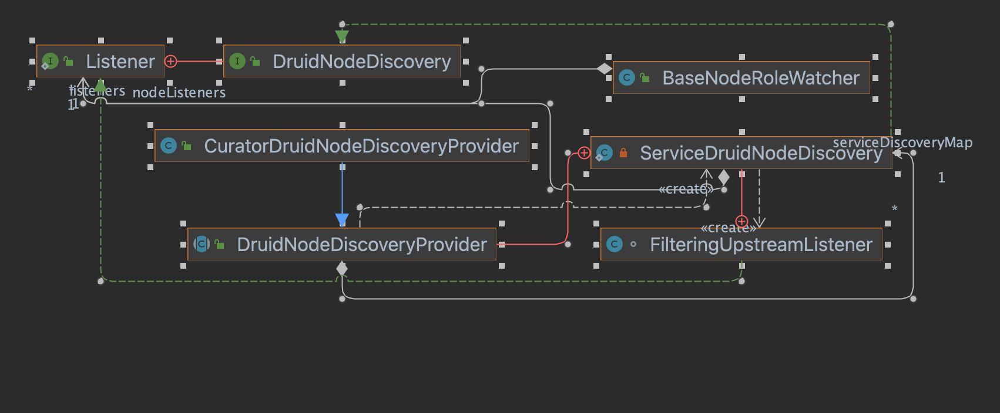
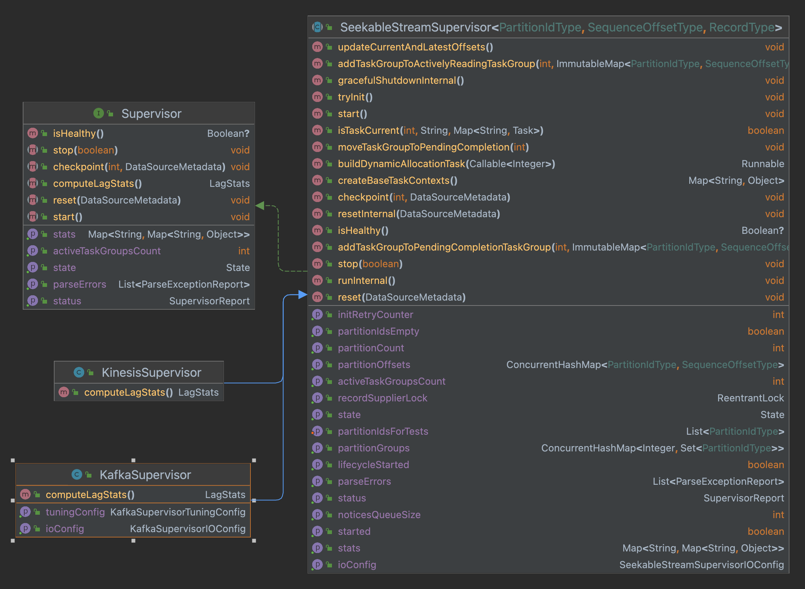

# Druid源码分析

[toc]

目录结构：


## Service启动

解析命令行使用 `Airline`，通过命令行参数构建 `Runnable` 对象，调用 `run()` 启动服务

```java
public class Main
{
  public static void main(String[] args)
  {
    //解析命令行
    final Runnable command = cli.parse(args);
    if (!(command instanceof Help)) { // Hack to work around Help not liking being injected
      //注入command对象
      injector.injectMembers(command);
    }
    //启动进程
    command.run();
  }
}
```

服务启动使用了模板设计模式


调用`ServerRunnable`的`run()`方法启动对应的服务。

```java
public abstract class ServerRunnable extends GuiceRunnable
{
  @Override
  public void run()
  {
    final Injector injector = makeInjector(getNodeRoles(getProperties()));
    //从injector里拿装载的Lifecyle
    final Lifecycle lifecycle = initLifecycle(injector);

    try {
      //等待线程运行结束
      lifecycle.join();
    }
    catch (Exception e) {
      throw new RuntimeException(e);
    }
  }
}
```

通过 `injector` 拿到 `Lifecycle` 对象，调用 `start()` 方法，启动服务

```java
public abstract class GuiceRunnable implements Runnable
{
  //子类中实现，该方法用于bind对象
  protected abstract List<? extends Module> getModules();
  
  //创建Injector，注入依赖，如CuratorModule、FirehoseModule等
  public Injector makeInjector(Set<NodeRole> nodeRoles)
  {
    try {
      return ServerInjectorBuilder.makeServerInjector(baseInjector, nodeRoles, getModules());
    }
    catch (Exception e) {
      throw new RuntimeException(e);
    }
  }
  
  public static Lifecycle initLifecycle(Injector injector, Logger log)
  {
    try {
      final Lifecycle lifecycle = injector.getInstance(Lifecycle.class);
      final StartupLoggingConfig startupLoggingConfig = injector.getInstance(StartupLoggingConfig.class);

      Long directSizeBytes = null;
      try {
        directSizeBytes = JvmUtils.getRuntimeInfo().getDirectMemorySizeBytes();
      }
      catch (UnsupportedOperationException ignore) {
        // querying direct memory is not supported
      }

      log.info(
          "Starting up with processors [%,d], memory [%,d], maxMemory [%,d]%s. Properties follow.",
          JvmUtils.getRuntimeInfo().getAvailableProcessors(),
          JvmUtils.getRuntimeInfo().getTotalHeapSizeBytes(),
          JvmUtils.getRuntimeInfo().getMaxHeapSizeBytes(),
          directSizeBytes != null ? StringUtils.format(", directMemory [%,d]", directSizeBytes) : ""
      );

      try {
        //启动进程
        lifecycle.start();
      }
      catch (Throwable t) {
        log.error(t, "Error when starting up.  Failing.");
        System.exit(1);
      }

      return lifecycle;
    }
    catch (Exception e) {
      throw new RuntimeException(e);
    }
  }
}
```

### Service生命周期

`Druid` 服务的生命周期抽象成 `Lifecycle` 类，包含4个 `Stage`：

- `INIT`：主要用于 `log4j` 的初始化；
- `NORMAL`：大多数对象的初始化都在这个阶段；
- `SERVER`：启动 `jetty` 服务器；
- `ANNOUNCEMENTS`：上述阶段完成后，会进入此状态，表示服务可用，通知整个集群

```java
public class Lifecycle
{
  private final Lock startStopLock = new ReentrantLock();
  
  private final NavigableMap<Stage, CopyOnWriteArrayList<Handler>> handlers;
  
  //保证当前状态的可见性
  private final AtomicReference<State> state = new AtomicReference<>(State.NOT_STARTED);
  
  private Stage currStage = null;
  
  public enum Stage
  {
    INIT,  //专门用于log4j的初始化
    NORMAL, //对大部分对象的配置，如zkClient，MetadataConnector的初始化
    SERVER, //适用于所有服务器对象
    ANNOUNCEMENTS //向集群宣告
  }
  
  private enum State
  {
    NOT_STARTED, //start()调用前
    RUNNING,  //start()调用后，stop()调用前
    STOP  //stop()调用后
  }
  
  //主要在NORMAL阶段，初始化其他对象
  public interface Handler
  {
    void start() throws Exception;

    void stop();
  }
  
  //大部分对象，如zkClient，MetadataConnector注入时调用此方法，在NORMAL阶段调用，添加handler
  public void addHandler(Handler handler, Stage stage)
  {
    if (!startStopLock.tryLock()) {
      throw new ISE("Cannot add a handler in the process of Lifecycle starting or stopping");
    }
    try {
      if (!state.get().equals(State.NOT_STARTED)) {
        throw new ISE("Cannot add a handler after the Lifecycle has started, it doesn't work that way.");
      }
      handlers.get(stage).add(handler);
    }
    finally {
      startStopLock.unlock();
    }
  }
  
  public Lifecycle(String name)
  {
    Preconditions.checkArgument(StringUtils.isNotEmpty(name), "Lifecycle name must not be null or empty");
    this.name = name;
    handlers = new TreeMap<>();
    //记录每个stage的执行
    for (Stage stage : Stage.values()) {
      handlers.put(stage, new CopyOnWriteArrayList<>());
    }
  }
  
  public void join() throws InterruptedException
  {
    ensureShutdownHook();
    Thread.currentThread().join();
  }
  
  //启动进程
  public void start() throws Exception
  {
    //加锁
    startStopLock.lock();
    try {
      //不等于NOT_STARTED，可能已经RUNNING或者停止
      if (!state.get().equals(State.NOT_STARTED)) {
        throw new ISE("Already started");
      }
      //等于NOT_STARTED，再判断一次是否有其他线程启动，若还是NOT_STARTED，置为RUNNING
      if (!state.compareAndSet(State.NOT_STARTED, State.RUNNING)) {
        throw new ISE("stop() is called concurrently with start()");
      }
      for (Map.Entry<Stage, ? extends List<Handler>> e : handlers.entrySet()) {
        currStage = e.getKey();
        log.info("Starting lifecycle [%s] stage [%s]", name, currStage.name());
        for (Handler handler : e.getValue()) {
          handler.start();
        }
      }
      log.info("Successfully started lifecycle [%s]", name);
    }
    finally {
      startStopLock.unlock();
    }
  }
  
  //结束进程
  public void stop()
  {
    //检查进程是否已经关闭
    if (!state.compareAndSet(State.RUNNING, State.STOP)) {
      log.info("Lifecycle [%s] already stopped and stop was called. Silently skipping", name);
      return;
    }
    startStopLock.lock();
    try {
      Exception thrown = null;
			//逆序处理每个Stage的handler
      for (Stage s : handlers.navigableKeySet().descendingSet()) {
        log.info("Stopping lifecycle [%s] stage [%s]", name, s.name());
        for (Handler handler : Lists.reverse(handlers.get(s))) {
          try {
            handler.stop();
          }
          catch (Exception e) {
            log.warn(e, "Lifecycle [%s] encountered exception while stopping %s", name, handler);
            if (thrown == null) {
              thrown = e;
            } else {
              thrown.addSuppressed(e);
            }
          }
        }
      }

      if (thrown != null) {
        throw new RuntimeException(thrown);
      }
    }
    finally {
      startStopLock.unlock();
    }
  }
}
```

### 对象注入

`Lifecycle` 用来管理注入的对象，注入需要创建 `Handler`，可选的注入方式：

1. 注入的对象包含 `start` 和 `stop` 方法，通过 `Lifecycle` 已经实现的 `StartCloseHandler` 封装实例

   ```java
   public <T> T addStartCloseInstance(T o)
   {
     addHandler(new StartCloseHandler(o));
     return o;
   }
   
   private static class StartCloseHandler implements Handler
   {
     private static final Logger log = new Logger(StartCloseHandler.class);
   
     private final Object o;
     private final Method startMethod;
     private final Method stopMethod;
   
     public StartCloseHandler(Object o)
     {
       this.o = o;
       try {
         startMethod = o.getClass().getMethod("start");
         stopMethod = o.getClass().getMethod("close");
       }
       catch (NoSuchMethodException e) {
         throw new RuntimeException(e);
       }
     }
   
     //调用实例的start方法
     @Override
     public void start() throws Exception
     {
       log.info("Starting object[%s]", o);
       startMethod.invoke(o);
     }
   
     //调用实例的stop方法
     @Override
     public void stop()
     {
       log.info("Stopping object[%s]", o);
       try {
         stopMethod.invoke(o);
       }
       catch (Exception e) {
         log.error(e, "Unable to invoke stopMethod() on %s", o.getClass());
       }
     }
   }
   ```

2. 有 `@LifecycleStart` 和 `@LifecycleStop` 注解标注的对象，通过 `Lifecycle` 已经实现的 `AnnotationBasedHandler` 封装实例

   ```java
   public <T> T addManagedInstance(T o)
   {
     addHandler(new AnnotationBasedHandler(o));
     return o;
   }
   
   private static class AnnotationBasedHandler implements Handler
   {
     private static final Logger log = new Logger(AnnotationBasedHandler.class);
   
     private final Object o;
   
     public AnnotationBasedHandler(Object o)
     {
       this.o = o;
     }
   
     @Override
     public void start() throws Exception
     {
       for (Method method : o.getClass().getMethods()) {
         boolean doStart = false;
         for (Annotation annotation : method.getAnnotations()) {
           //查找实例带有@LifecycleStart注解的方法
           if (LifecycleStart.class.getName().equals(annotation.annotationType().getName())) {
             doStart = true;
             break;
           }
         }
         if (doStart) {
           log.debug("Invoking start method[%s] on object[%s].", method, o);
           method.invoke(o);
         }
       }
     }
   
     @Override
     public void stop()
     {
       for (Method method : o.getClass().getMethods()) {
         boolean doStop = false;
         for (Annotation annotation : method.getAnnotations()) {
           if (LifecycleStop.class.getName().equals(annotation.annotationType().getName())) {
             doStop = true;
             break;
           }
         }
         if (doStop) {
           log.debug("Invoking stop method[%s] on object[%s].", method, o);
           try {
             method.invoke(o);
           }
           catch (Exception e) {
             log.error(e, "Exception when stopping method[%s] on object[%s]", method, o);
           }
         }
       }
     }
   }
   ```

3. 自定义 `Handler` 传入

### Coordinator启动初始化

启动后先加载 `jar` 包，初始化配置后进入 `INIT` 状态，随后进入 `NORMAL` 状态，对注入的对象实例进行初始化：

- `Zookeeper`：完成对 `Zookeeper` 的连接
- `MetadataStorageConnector`：完成 `metadata db` 的连接初始化，并创建 `druid_segments` 等表
- `HttpServerInventoryView`：启动调用服务发现
- `CoordinatorServerView`：获取集群中正在加载的 `segment` 的状态
- `MetadataRuleManager`：获取 `datasource` 的载入规则

之后进行 `Leader` 选举，选举成功初始化对象实例：

- `SegmentsMetadataManager`：加载 `segment` 的元数据信息
- `SegmentAllocationQueue`：初始化 `segment` 分配队列
- `MetadataStorageActionHandler`：从 `druid_tasks` 中还原 `task`

对象初始化完成，进入 `Server` 状态，启动 `jetty` 服务器；启动成功，通知整个集群该服务可用，进入 `ANNOUNCEMENTS` 状态，之后定期执行 `CoordinatorDuty`，包括 `BalanceSegments` 、`KillSupervisors` 和 `LogUsedSegments` 等

### Overlord启动初始化

若 `Overlord` 和 `Coordinator` 部署在同一个 `JVM` 中，`Coordinator` 进入 `ANNOUNCEMENTS` 状态后，开始 `Overlord` 的启动初始化。启动名为`task-master` 的 `lifecycle`，进入 `NORMAL` 状态后，初始化对象：

- `WorkerTaskRunner`：管理 `MiddleManager` 上的任务，使用内部发现机制获取信息
- `TaskQueue`：生产者和 `TaskRunner` 间的接口，从生产者接收任务分配给 `TaskRunner`
- `TaskLockbox`：记录目前正在活跃的任务，锁定了哪些 `interval` 和 `segment`，辅助任务的分配
- `SupervisorManager`：管理 `Supervisor` 的创建和生命周期

选举 `Leader` 成功后，进入 `Server` 状态启动 `jetty` 服务器，通知集群服务可用，进入 `ANNOUNCEMENTS` 状态，定期执行 `Overlord`，包括 `TaskLogAutoCleaner` 和 `DurableStorageCleaner`

### Historical启动初始化

启动后加载 `jar` 包，`OffheapBufferGenerator` 先分配 `buffer` ，之后进入 `INIT` 、`NORMAL` 状态，初始化实例后，进入 `Server` 状态，查找可用的 `Coordinator` ；进入 `ANNOUNCEMENTS` 状态，向集群通知自己，定期更新加载可用的 `segment` ，相关实例：

- `DataSegmentChangeHandler`：更新加载可用的 `segment`
- `HdfsDataSegmentPuller`：定期从 `deepstorage` 拉取数据
- `DataSegmentAnnouncer`：宣布 `segment` 可用

### MiddleManager启动初始化

启动后加载 `jar` 包，进入 `SERVER` 状态后，查找可用的 `Overlord` 。`ANNOUNCEMENTS` 状态后，`WorkerTaskManager` 接收 `Overlord` 分配的任务，`ForkingTaskRunner` 启动 `Peon` 进程执行任务，保存任务的日志，运行结束后删除目录

### Broker启动初始化

启动后加载 `jar` 包，进入 `SERVER` 状态后，查找可用的节点，包括 `Overlord`、`Historical`、`Peon`、`Indexer`、`Coordinator`。

## Leader选举

`Druid` 的 `Leader` 选举通过 `DruidLeaderSelector` 接口，借助 `Curator` 框架实现


```java
public class CuratorDruidLeaderSelector implements DruidLeaderSelector
{
  private final LifecycleLock lifecycleLock = new LifecycleLock();

  private final DruidNode self;
  private final CuratorFramework curator;
  private final String latchPath;

  private ExecutorService listenerExecutor;

  private DruidLeaderSelector.Listener listener = null;
  private final AtomicReference<LeaderLatch> leaderLatch = new AtomicReference<>();

  private volatile boolean leader = false;
  private volatile int term = 0;

  public CuratorDruidLeaderSelector(CuratorFramework curator, @Self DruidNode self, String latchPath)
  {
    this.curator = curator;
    this.self = self;
    this.latchPath = latchPath;
    //初始化创建一个leaderlatch，便于查询当前的leader
    this.leaderLatch.set(createNewLeaderLatch());
  }

  private LeaderLatch createNewLeaderLatch()
  {
    return new LeaderLatch(curator, latchPath, self.getServiceScheme() + "://" + self.getHostAndPortToUse());
  }

  private LeaderLatch createNewLeaderLatchWithListener()
  {
    final LeaderLatch newLeaderLatch = createNewLeaderLatch();

    newLeaderLatch.addListener(
        new LeaderLatchListener()
        {
          @Override
          public void isLeader()
          {
            try {
              if (leader) {
                log.warn("I'm being asked to become leader. But I am already the leader. Ignored event.");
                return;
              }

              leader = true;
              term++;
              //执行成为leader之后的方法
              listener.becomeLeader();
            }
            catch (Exception ex) {
              log.makeAlert(ex, "listener becomeLeader() failed. Unable to become leader").emit();
              CloseableUtils.closeAndSuppressExceptions(
                  createNewLeaderLatchWithListener(),
                  e -> log.warn("Could not close old leader latch; continuing with new one anyway.")
              );
              leader = false;
              try {
                //等待其他实例成为leader
                Thread.sleep(ThreadLocalRandom.current().nextInt(1000, 5000));
                leaderLatch.get().start();
              }
              catch (Exception e) {
                //捕获未知的异常
                log.makeAlert(e, "I am a zombie").emit();
              }
            }
          }

          @Override
          public void notLeader()
          {
            try {
              if (!leader) {
                log.warn("I'm being asked to stop being leader. But I am not the leader. Ignored event.");
                return;
              }
              leader = false;
              listener.stopBeingLeader();
            }
            catch (Exception ex) {
              log.makeAlert(ex, "listener.stopBeingLeader() failed. Unable to stopBeingLeader").emit();
            }
          }
        },
        listenerExecutor
    );

    return leaderLatch.getAndSet(newLeaderLatch);
  }

  @Nullable
  @Override
  public String getCurrentLeader()
  {
    try {
      final LeaderLatch latch = leaderLatch.get();

      Participant participant = latch.getLeader();
      if (participant.isLeader()) {
        return participant.getId();
      }

      return null;
    }
    catch (Exception e) {
      throw new RuntimeException(e);
    }
  }

  @Override
  public boolean isLeader()
  {
    return leader;
  }

  @Override
  public int localTerm()
  {
    return term;
  }

  @Override
  public void registerListener(DruidLeaderSelector.Listener listener)
  {
    Preconditions.checkArgument(listener != null, "listener is null.");

    if (!lifecycleLock.canStart()) {
      throw new ISE("can't start.");
    }
    try {
      this.listener = listener;
      this.listenerExecutor = Execs.singleThreaded(
          StringUtils.format(
              "LeaderSelector[%s]",
              StringUtils.encodeForFormat(latchPath)
          )
      );

      createNewLeaderLatchWithListener();
      leaderLatch.get().start();

      lifecycleLock.started();
    }
    catch (Exception ex) {
      throw new RuntimeException(ex);
    }
    finally {
      lifecycleLock.exitStart();
    }
  }

  @Override
  public void unregisterListener()
  {
    if (!lifecycleLock.canStop()) {
      throw new ISE("can't stop.");
    }

    CloseableUtils.closeAndSuppressExceptions(leaderLatch.get(), e -> log.warn(e, "Failed to close LeaderLatch."));
    listenerExecutor.shutdownNow();
  }
}
```

`Coordinator` 的 `Leader` 选举在 `DruidCoordinator` 对象注入时执行：

```java
@ManageLifecycle
public class DruidCoordinator
{  
  private final DruidLeaderSelector coordLeaderSelector;
  
  @LifecycleStart
  public void start()
  {
    synchronized (lock) {
      if (started) {
        return;
      }
      started = true;

      coordLeaderSelector.registerListener(
          new DruidLeaderSelector.Listener()
          {
            @Override
            public void becomeLeader()
            {
              DruidCoordinator.this.becomeLeader();
            }

            @Override
            public void stopBeingLeader()
            {
              DruidCoordinator.this.stopBeingLeader();
            }
          }
      );
    }
  }
}
```

`Overlord` 的 `Leader` 选举在 `TaskMaster` 对象注入时执行：

```java
public class TaskMaster implements TaskCountStatsProvider, TaskSlotCountStatsProvider
{
	private final DruidLeaderSelector overlordLeaderSelector;
	
	@LifecycleStart
  public void start()
  {
    giant.lock();

    try {
      overlordLeaderSelector.registerListener(leadershipListener);
    }
    finally {
      giant.unlock();
    }
  }
}
```

## Coordinator

```java
@ManageLifecycle
public class DruidCoordinator
{
  private void becomeLeader()
  {
    synchronized (lock) {
      if (!started) {
        return;
      }
      log.info(
          "I am the leader of the coordinators, all must bow! Starting coordination in [%s].",
          config.getCoordinatorStartDelay()
      );
      //从db拉取元数据信息
      segmentsMetadataManager.startPollingDatabasePeriodically();
      metadataRuleManager.start(); //加载load规则
      lookupCoordinatorManager.start(); //管理lookup
      serviceAnnouncer.announce(self); //通知集群可用
      final int startingLeaderCounter = coordLeaderSelector.localTerm();
      //加入其他的Coordinator
      final List<Pair<? extends DutiesRunnable, Duration>> dutiesRunnables = new ArrayList<>();
      dutiesRunnables.add(
          Pair.of(
              new DutiesRunnable(makeHistoricalManagementDuties(), startingLeaderCounter, HISTORICAL_MANAGEMENT_DUTIES_DUTY_GROUP),
              config.getCoordinatorPeriod()
          )
      );
      if (indexingServiceClient != null) {
        dutiesRunnables.add(
            Pair.of(
                new DutiesRunnable(makeIndexingServiceDuties(), startingLeaderCounter, INDEXING_SERVICE_DUTIES_DUTY_GROUP),
                config.getCoordinatorIndexingPeriod()
            )
        );
      }
      dutiesRunnables.add(
          Pair.of(
              new DutiesRunnable(makeMetadataStoreManagementDuties(), startingLeaderCounter, METADATA_STORE_MANAGEMENT_DUTIES_DUTY_GROUP),
              config.getCoordinatorMetadataStoreManagementPeriod()
          )
      );

      for (CoordinatorCustomDutyGroup customDutyGroup : customDutyGroups.getCoordinatorCustomDutyGroups()) {
        dutiesRunnables.add(
            Pair.of(
                new DutiesRunnable(customDutyGroup.getCustomDutyList(), startingLeaderCounter, customDutyGroup.getName()),
                customDutyGroup.getPeriod()
            )
        );
        log.info(
            "Done making custom coordinator duties %s for group %s",
            customDutyGroup.getCustomDutyList().stream().map(duty -> duty.getClass().getName()).collect(Collectors.toList()),
            customDutyGroup.getName()
        );
      }

      for (final Pair<? extends DutiesRunnable, Duration> dutiesRunnable : dutiesRunnables) {
        // CompactSegmentsDuty can takes a non trival amount of time to complete.
        // Hence, we schedule at fixed rate to make sure the other tasks still run at approximately every
        // config.getCoordinatorIndexingPeriod() period. Note that cautious should be taken
        // if setting config.getCoordinatorIndexingPeriod() lower than the default value.
        ScheduledExecutors.scheduleAtFixedRate(
            exec,
            config.getCoordinatorStartDelay(),
            dutiesRunnable.rhs,
            new Callable<ScheduledExecutors.Signal>()
            {
              private final DutiesRunnable theRunnable = dutiesRunnable.lhs;

              @Override
              public ScheduledExecutors.Signal call()
              {
                if (coordLeaderSelector.isLeader() && startingLeaderCounter == coordLeaderSelector.localTerm()) {
                  theRunnable.run();
                }
                if (coordLeaderSelector.isLeader()
                    && startingLeaderCounter == coordLeaderSelector.localTerm()) { // (We might no longer be leader)
                  return ScheduledExecutors.Signal.REPEAT;
                } else {
                  return ScheduledExecutors.Signal.STOP;
                }
              }
            }
        );
      }
    }
  }
}
```

## Overlord

竞选 `Leader` 成功后启动 `Lifecycle`，初始化启动注入的实例

```java
public class TaskMaster implements TaskCountStatsProvider, TaskSlotCountStatsProvider
{
  private final DruidLeaderSelector overlordLeaderSelector;
  private final DruidLeaderSelector.Listener leadershipListener;

  private final ReentrantLock giant = new ReentrantLock(true);
  private final TaskActionClientFactory taskActionClientFactory;
  private final SupervisorManager supervisorManager;

  private final AtomicReference<Lifecycle> leaderLifecycleRef = new AtomicReference<>(null);

  private volatile TaskRunner taskRunner;
  private volatile TaskQueue taskQueue;
  //表明所有的服务已经启动
  private volatile boolean initialized;
  
  @Inject
  public TaskMaster(
      final TaskLockConfig taskLockConfig,
      final TaskQueueConfig taskQueueConfig,
      final DefaultTaskConfig defaultTaskConfig,
      final TaskLockbox taskLockbox,
      final TaskStorage taskStorage,
      final TaskActionClientFactory taskActionClientFactory,
      @Self final DruidNode selfNode,
      final TaskRunnerFactory runnerFactory,
      final ServiceAnnouncer serviceAnnouncer,
      final CoordinatorOverlordServiceConfig coordinatorOverlordServiceConfig,
      final ServiceEmitter emitter,
      final SupervisorManager supervisorManager,
      final OverlordDutyExecutor overlordDutyExecutor,
      @IndexingService final DruidLeaderSelector overlordLeaderSelector,
      final SegmentAllocationQueue segmentAllocationQueue
  )
  {
    this.supervisorManager = supervisorManager;
    this.taskActionClientFactory = taskActionClientFactory;

    this.overlordLeaderSelector = overlordLeaderSelector;

    final DruidNode node = coordinatorOverlordServiceConfig.getOverlordService() == null ? selfNode :
                           selfNode.withService(coordinatorOverlordServiceConfig.getOverlordService());

    this.leadershipListener = new DruidLeaderSelector.Listener()
    {
      @Override
      public void becomeLeader()
      {
        giant.lock();
        log.info("By the power of Grayskull, I have the power!");
        try {
          // 初始化TaskRunner和TaskQueue
          taskRunner = runnerFactory.build();
          taskQueue = new TaskQueue(
              taskLockConfig,
              taskQueueConfig,
              defaultTaskConfig,
              taskStorage,
              taskRunner,
              taskActionClientFactory,
              taskLockbox,
              emitter
          );

   				// 创建启动lifecycle
          final Lifecycle leaderLifecycle = new Lifecycle("task-master");
          if (leaderLifecycleRef.getAndSet(leaderLifecycle) != null) {
            log.makeAlert("TaskMaster set a new Lifecycle without the old one being cleared!  Race condition")
               .emit();
          }

          leaderLifecycle.addManagedInstance(taskRunner);
          leaderLifecycle.addManagedInstance(taskQueue);
          leaderLifecycle.addManagedInstance(supervisorManager);
          leaderLifecycle.addManagedInstance(overlordDutyExecutor);
          // 启动SegmentAllocationQueue
          leaderLifecycle.addHandler(
              new Lifecycle.Handler()
              {
                @Override
                public void start()
                {
                  segmentAllocationQueue.becomeLeader();
                }

                @Override
                public void stop()
                {
                  segmentAllocationQueue.stopBeingLeader();
                }
              }
          );

          //通知集群节点可用
          leaderLifecycle.addHandler(
              new Lifecycle.Handler()
              {
                @Override
                public void start()
                {
                  initialized = true;
                  serviceAnnouncer.announce(node);
                }

                @Override
                public void stop()
                {
                  serviceAnnouncer.unannounce(node);
                }
              }
          );

          leaderLifecycle.start();
        }
        catch (Exception e) {
          throw new RuntimeException(e);
        }
        finally {
          giant.unlock();
        }
      }

      @Override
      public void stopBeingLeader()
      {
        giant.lock();
        try {
          initialized = false;
          final Lifecycle leaderLifecycle = leaderLifecycleRef.getAndSet(null);

          if (leaderLifecycle != null) {
            leaderLifecycle.stop();
          }
        }
        finally {
          giant.unlock();
        }
      }
    };
  }
}
```

### 服务发现



#### DruidNodeDiscovery

节点服务发现接口

```java
public interface DruidNodeDiscovery
{
  //返回所有已经发现的DruidNode元信息
  Collection<DiscoveryDruidNode> getAllNodes();
  void registerListener(Listener listener);

  default void removeListener(Listener listener)
  {
    // do nothing
  }

  //监听DruidNodeDiscovery实例
  interface Listener
  {
    void nodesAdded(Collection<DiscoveryDruidNode> nodes);

    void nodesRemoved(Collection<DiscoveryDruidNode> nodes);

    default void nodeViewInitialized()
    {
      // do nothing
    }
  }
}
```

#### DruidNodeDiscoveryProvider

作用像 `DruidNodeDiscovery` 的工厂类

```java
public abstract class DruidNodeDiscoveryProvider
{
  //key: 服务名；value: noderole集合
  private static final Map<String, Set<NodeRole>> SERVICE_TO_NODE_TYPES = ImmutableMap.of(
      LookupNodeService.DISCOVERY_SERVICE_KEY,
      ImmutableSet.of(NodeRole.BROKER, NodeRole.HISTORICAL, NodeRole.PEON, NodeRole.INDEXER),
      DataNodeService.DISCOVERY_SERVICE_KEY,
      ImmutableSet.of(NodeRole.HISTORICAL, NodeRole.PEON, NodeRole.INDEXER, NodeRole.BROKER),
      WorkerNodeService.DISCOVERY_SERVICE_KEY,
      ImmutableSet.of(NodeRole.MIDDLE_MANAGER, NodeRole.INDEXER)
  );
  //key:service名称，value:DruidNodeDiscovery实例
  private final ConcurrentHashMap<String, ServiceDruidNodeDiscovery> serviceDiscoveryMap =
      new ConcurrentHashMap<>(SERVICE_TO_NODE_TYPES.size());
  
	//判断给定DruidNode是否为给定的NodeRole
  public abstract BooleanSupplier getForNode(DruidNode node, NodeRole nodeRole);

  //返回给定NodeRole的DruidNodeDiscovery实例
  public abstract DruidNodeDiscovery getForNodeRole(NodeRole nodeRole);

  //获取DruidNodeDiscovery实例，发现其在元数据中宣布的节点
  public DruidNodeDiscovery getForService(String serviceName)
  {
    return serviceDiscoveryMap.computeIfAbsent(
        serviceName,
        service -> {
          //获得需要查找的noderole
          Set<NodeRole> nodeRolesToWatch = DruidNodeDiscoveryProvider.SERVICE_TO_NODE_TYPES.get(service);
          if (nodeRolesToWatch == null) {
            throw new IAE("Unknown service [%s].", service);
          }
          //创建一个DruidNodeDiscovery实例
          ServiceDruidNodeDiscovery serviceDiscovery = new ServiceDruidNodeDiscovery(service, nodeRolesToWatch.size());
          //创建Listener监听ServiceDruidNodeDiscovery，根据serviceName过滤
          DruidNodeDiscovery.Listener filteringGatheringUpstreamListener =
              serviceDiscovery.filteringUpstreamListener();
          //获取指定NodeRole的DruidNodeDiscovery，注册Listener
          //注册Listener时会执行listener.nodeViewInitialized，更新ServiceDruidNodeDiscovery的uninitializedNodeRoles
          //所有NodeRole的DruidNodeDiscovery注册完Listener，ServiceDruidNodeDiscovery完成初始化
          //开始初始化ServiceDruidNodeDiscover所有的listener
          for (NodeRole nodeRole : nodeRolesToWatch) {
            getForNodeRole(nodeRole).registerListener(filteringGatheringUpstreamListener);
          }
          return serviceDiscovery;
        }
    );
  }

  private static class ServiceDruidNodeDiscovery implements DruidNodeDiscovery
  {
    private static final Logger log = new Logger(ServiceDruidNodeDiscovery.class);
    //服务名称
    private final String service;
    //key:host+port
    private final ConcurrentMap<String, DiscoveryDruidNode> nodes = new ConcurrentHashMap<>();
    private final Collection<DiscoveryDruidNode> unmodifiableNodes = Collections.unmodifiableCollection(nodes.values());
    //已经注册的Listener
    private final List<Listener> listeners = new ArrayList<>();

    private final Object lock = new Object();

    private int uninitializedNodeRoles;

    ServiceDruidNodeDiscovery(String service, int watchedNodeRoles)
    {
      Preconditions.checkArgument(watchedNodeRoles > 0);
      this.service = service;
      this.uninitializedNodeRoles = watchedNodeRoles;
    }

    @Override
    public Collection<DiscoveryDruidNode> getAllNodes()
    {
      return unmodifiableNodes;
    }

    
    @Override
    public void registerListener(Listener listener)
    {
      if (listener instanceof FilteringUpstreamListener) {
        throw new IAE("FilteringUpstreamListener should not be registered with ServiceDruidNodeDiscovery itself");
      }
      synchronized (lock) {
        if (!unmodifiableNodes.isEmpty()) {
          listener.nodesAdded(unmodifiableNodes);
        }
        //所有NodeRole均初始化，listener开始初始化
        if (uninitializedNodeRoles == 0) {
          listener.nodeViewInitialized();
        }
        listeners.add(listener);
      }
    }

    DruidNodeDiscovery.Listener filteringUpstreamListener()
    {
      return new FilteringUpstreamListener();
    }

    //监听所有更新的节点，根据service名再做过滤，用于getForNodeRole注册getForNodeRole返回的DruidNodeDiscovery
    class FilteringUpstreamListener implements DruidNodeDiscovery.Listener
    {
      @Override
      public void nodesAdded(Collection<DiscoveryDruidNode> nodesDiscovered)
      {
        synchronized (lock) {
          List<DiscoveryDruidNode> nodesAdded = new ArrayList<>();
          for (DiscoveryDruidNode node : nodesDiscovered) {
            //根据service名称更新缓存nodes
            if (node.getServices().containsKey(service)) {
              DiscoveryDruidNode prev = nodes.putIfAbsent(node.getDruidNode().getHostAndPortToUse(), node);

              if (prev == null) {
                nodesAdded.add(node);
              } else {
                log.warn("Node[%s] discovered but already exists [%s].", node, prev);
              }
            } else {
              log.warn("Node[%s] discovered but doesn't have service[%s]. Ignored.", node, service);
            }
          }

          if (nodesAdded.isEmpty()) {
            // Don't bother listeners with an empty update, it doesn't make sense.
            return;
          }

          Collection<DiscoveryDruidNode> unmodifiableNodesAdded = Collections.unmodifiableCollection(nodesAdded);
          for (Listener listener : listeners) {
            try {
              //通知注册在ServiceDruidNodeDiscovery上的Listener
              listener.nodesAdded(unmodifiableNodesAdded);
            }
            catch (Exception ex) {
              log.error(ex, "Listener[%s].nodesAdded(%s) threw exception. Ignored.", listener, nodesAdded);
            }
          }
        }
      }

      @Override
      public void nodesRemoved(Collection<DiscoveryDruidNode> nodesDisappeared)
      {
        synchronized (lock) {
          List<DiscoveryDruidNode> nodesRemoved = new ArrayList<>();
          for (DiscoveryDruidNode node : nodesDisappeared) {
            DiscoveryDruidNode prev = nodes.remove(node.getDruidNode().getHostAndPortToUse());
            if (prev != null) {
              nodesRemoved.add(node);
            } else {
              log.warn("Node[%s] disappeared but was unknown for service listener [%s].", node, service);
            }
          }

          if (nodesRemoved.isEmpty()) {
            // Don't bother listeners with an empty update, it doesn't make sense.
            return;
          }

          Collection<DiscoveryDruidNode> unmodifiableNodesRemoved = Collections.unmodifiableCollection(nodesRemoved);
          for (Listener listener : listeners) {
            try {
              listener.nodesRemoved(unmodifiableNodesRemoved);
            }
            catch (Exception ex) {
              log.error(ex, "Listener[%s].nodesRemoved(%s) threw exception. Ignored.", listener, nodesRemoved);
            }
          }
        }
      }

      @Override
      public void nodeViewInitialized()
      {
        synchronized (lock) {
          if (uninitializedNodeRoles == 0) {
            log.error("Unexpected call of nodeViewInitialized()");
            return;
          }
          uninitializedNodeRoles--;
          if (uninitializedNodeRoles == 0) {
            for (Listener listener : listeners) {
              try {
                listener.nodeViewInitialized();
              }
              catch (Exception ex) {
                log.error(ex, "Listener[%s].nodeViewInitialized() threw exception. Ignored.", listener);
              }
            }
          }
        }
      }
    }
  }
}
```

#### BaseNodeRoleWatcher

实现 `DruidNodeDiscovery` 接口的通用代码，使用该对象需要指定 `NodeRole`

```java
public class BaseNodeRoleWatcher
{
  private final NodeRole nodeRole;

  //hostAndPort -> DiscoveryDruidNode
  private final ConcurrentMap<String, DiscoveryDruidNode> nodes = new ConcurrentHashMap<>();
  //nodes的快照
  private final Collection<DiscoveryDruidNode> unmodifiableNodes = Collections.unmodifiableCollection(nodes.values());

  private final ExecutorService listenerExecutor;

  private final List<DruidNodeDiscovery.Listener> nodeListeners = new ArrayList<>();

  private final Object lock = new Object();

  private final CountDownLatch cacheInitialized = new CountDownLatch(1);

  public BaseNodeRoleWatcher(
      ExecutorService listenerExecutor,
      NodeRole nodeRole
  )
  {
    this.listenerExecutor = listenerExecutor;
    this.nodeRole = nodeRole;
  }

  //计数器减少为0返回unmodifiableNodes
  public Collection<DiscoveryDruidNode> getAllNodes()
  {
    boolean nodeViewInitialized;
    try {
      //等待倒计时器减为0，超过30s则直接返回，警告信息可能不完整
      nodeViewInitialized = cacheInitialized.await((long) 30, TimeUnit.SECONDS);
    }
    catch (InterruptedException ex) {
      Thread.currentThread().interrupt();
      nodeViewInitialized = false;
    }
    if (!nodeViewInitialized) {
      LOGGER.info(
          "Cache for node role [%s] not initialized yet; getAllNodes() might not return full information.",
          nodeRole.getJsonName()
      );
    }
    return unmodifiableNodes;
  }

  public void registerListener(DruidNodeDiscovery.Listener listener)
  {
    synchronized (lock) {
      //注册listener时，通知listener已经发现的节点，同时初始化listener的缓存
      if (cacheInitialized.getCount() == 0) {
        List<DiscoveryDruidNode> currNodes = Lists.newArrayList(nodes.values());
        safeSchedule(
            () -> {
              listener.nodesAdded(currNodes);
              listener.nodeViewInitialized();
            },
            "Exception occurred in nodesAdded([%s]) in listener [%s].", currNodes, listener
        );
      }
      nodeListeners.add(listener);
    }
  }

  //添加DiscoveryDruidNode前先判断NodeRole是否与当前实例匹配，匹配才添加
  public void childAdded(DiscoveryDruidNode druidNode)
  {
    synchronized (lock) {
      if (!nodeRole.equals(druidNode.getNodeRole())) {
        LOGGER.error(
            "Node [%s] of role [%s] addition ignored due to mismatched role (expected role [%s]).",
            druidNode.getDruidNode().getUriToUse(),
            druidNode.getNodeRole().getJsonName(),
            nodeRole.getJsonName()
        );
        return;
      }

      LOGGER.info("Node [%s] of role [%s] detected.", druidNode.getDruidNode().getUriToUse(), nodeRole.getJsonName());

      addNode(druidNode);
    }
  }

  //若有新的DiscoveryDruidNode，通知所有的Listener执行nodeAdd操作
  @GuardedBy("lock")
  private void addNode(DiscoveryDruidNode druidNode)
  {
    DiscoveryDruidNode prev = nodes.putIfAbsent(druidNode.getDruidNode().getHostAndPortToUse(), druidNode);
    if (prev == null) {
      // No need to wait on CountDownLatch, because we are holding the lock under which it could only be counted down.
      if (cacheInitialized.getCount() == 0) {
        List<DiscoveryDruidNode> newNode = ImmutableList.of(druidNode);
        for (DruidNodeDiscovery.Listener listener : nodeListeners) {
          safeSchedule(
              () -> listener.nodesAdded(newNode),
              "Exception occurred in nodeAdded(node=[%s]) in listener [%s].",
              druidNode.getDruidNode().getHostAndPortToUse(),
              listener
          );
        }
      }
    } else {
      LOGGER.error(
          "Node [%s] of role [%s] discovered but existed already [%s].",
          druidNode.getDruidNode().getUriToUse(),
          nodeRole.getJsonName(),
          prev
      );
    }
  }

  //初始化，倒计时器减一，触发其他操作。初始化时会通知每个Listener初始化、执行nodeAdd
  public void cacheInitialized()
  {
    synchronized (lock) {
      if (cacheInitialized.getCount() == 0) {
        LOGGER.error("cache is already initialized. ignoring cache initialization event.");
        return;
      }
      
      List<DiscoveryDruidNode> currNodes = Lists.newArrayList(nodes.values());
      LOGGER.info(
          "Node watcher of role [%s] is now initialized with %d nodes.",
          nodeRole.getJsonName(),
          currNodes.size());

      for (DruidNodeDiscovery.Listener listener : nodeListeners) {
        safeSchedule(
            () -> {
              listener.nodesAdded(currNodes);
              listener.nodeViewInitialized();
            },
            "Exception occurred in nodesAdded([%s]) in listener [%s].",
            currNodes,
            listener
        );
      }

      cacheInitialized.countDown();
    }
  }
}

```

### Task

`TaskMaster` 初始化时，会创建 `TaskRunner` 实例，用于分配监控任务

#### TaskRunner


用于交接 `task` 的接口，维护 `task` 的状态，决定了运行 `task` 的方式，可通过 `druid.indexer.runner.type` 配置。

分布式环境下有 `remote` 和 `httpremote` 两种方式，`remote` 方式下 `overlord` 通过 `zookeeper` 和 `middlemanager` 交互，`httpRemote` 方式下用 `http` 的方式和 `middlemanager` 交互


##### RemoteTaskRunner

职责：分配 `task` 到 `worker` 

在 `zookeeper` 上创建临时节点，为 `worker` 分配 `task` 。如果达到 `worker` 的容量，`task` 分配会失败。

```java
public class RemoteTaskRunner implements WorkerTaskRunner, TaskLogStreamer
{
  private final CuratorFramework cf;
  private final PathChildrenCacheFactory workerStatusPathChildrenCacheFactory;
  private final ExecutorService workerStatusPathChildrenCacheExecutor;
  private final PathChildrenCache workerPathCache;
  private final HttpClient httpClient;
  private final Supplier<WorkerBehaviorConfig> workerConfigRef;

  // all workers that exist in ZK
  //<workerId, ZkWorker>，保存所有注册到zk的worker
  private final ConcurrentMap<String, ZkWorker> zkWorkers = new ConcurrentHashMap<>();
  //pendingTask的payload
  private final ConcurrentMap<String, Task> pendingTaskPayloads = new ConcurrentHashMap<>();
  //<taskId, RemoteTaskRunnerWorkItem>，存放还没分配给worker的task，worker和location先初始化为null
  private final RemoteTaskRunnerWorkQueue pendingTasks = new RemoteTaskRunnerWorkQueue();
  //<taskId, RemoteTaskRunnerWorkItem>，已经分配的task，加入该集合并不代表该task真正开始执行了
  private final RemoteTaskRunnerWorkQueue runningTasks = new RemoteTaskRunnerWorkQueue();
  // tasks that are complete but not cleaned up yet
  private final RemoteTaskRunnerWorkQueue completeTasks = new RemoteTaskRunnerWorkQueue();

  private final ExecutorService runPendingTasksExec;
  //这些worker没有运行task，可安全终止
  private final ConcurrentMap<String, ZkWorker> lazyWorkers = new ConcurrentHashMap<>();

  // Workers that have been blacklisted.
  private final Set<ZkWorker> blackListedWorkers = Collections.synchronizedSet(new HashSet<>());
  //TaskRunner的listener，主要是supervisor
  private final CopyOnWriteArrayList<Pair<TaskRunnerListener, Executor>> listeners = new CopyOnWriteArrayList<>();
  //<workerId,taskId>，已分配task但还没执行的worker
  private final ConcurrentMap<String, String> workersWithUnacknowledgedTask = new ConcurrentHashMap<>();
  //<taskId, taskId> 尝试将pendingTask分配给worker执行
  private final ConcurrentMap<String, String> tryAssignTasks = new ConcurrentHashMap<>();

  private final Object statusLock = new Object();

  private final ListeningScheduledExecutorService cleanupExec;
	//存放即将被清除的worker，key: workerId
  private final ConcurrentMap<String, ScheduledFuture> removedWorkerCleanups = new ConcurrentHashMap<>();
  //负责资源管理
  private final ProvisioningStrategy<WorkerTaskRunner> provisioningStrategy;
  private final ServiceEmitter emitter;
  //决定worker的状态
  private ProvisioningService provisioningService;

  @Override
  @LifecycleStart
  public void start()
  {
    if (!lifecycleLock.canStart()) {
      return;
    }
    try {
      log.info("Starting RemoteTaskRunner...");
      //记录当前操作waitingForMonitor锁的线程数
      final MutableInt waitingFor = new MutableInt(1);
      final Object waitingForMonitor = new Object();

      //监控worker的创建删除
      workerPathCache.getListenable().addListener(
          (client, event) -> {
            final Worker worker;
            switch (event.getType()) {
              //新的worker加入
              case CHILD_ADDED:
                worker = jsonMapper.readValue(
                    event.getData().getData(),
                    Worker.class
                );
                synchronized (waitingForMonitor) {
                  waitingFor.increment();
                }
                Futures.addCallback(
                    addWorker(worker),
                    new FutureCallback<ZkWorker>()
                    {
                      @Override
                      public void onSuccess(ZkWorker zkWorker)
                      {
                        synchronized (waitingForMonitor) {
                          waitingFor.decrement();
                          waitingForMonitor.notifyAll();
                        }
                      }

                      @Override
                      public void onFailure(Throwable throwable)
                      {
                        synchronized (waitingForMonitor) {
                          waitingFor.decrement();
                          waitingForMonitor.notifyAll();
                        }
                      }
                    }
                );
                break;
              //更新worker
              case CHILD_UPDATED:
                worker = jsonMapper.readValue(
                    event.getData().getData(),
                    Worker.class
                );
                updateWorker(worker);
                break;
							//删除worker
              case CHILD_REMOVED:
                worker = jsonMapper.readValue(
                    event.getData().getData(),
                    Worker.class
                );
                //清除worker，同时确保该worker上的task都已完成
                removeWorker(worker);
                break;
              //初始化
              case INITIALIZED:
                List<String> workers;
                try {
                  //获取当前所有的worker
                  workers = cf.getChildren().forPath(indexerZkConfig.getStatusPath());
                }
                catch (KeeperException.NoNodeException e) {
                  workers = ImmutableList.of();
                }
                for (String workerId : workers) {
                  final String workerAnnouncePath = JOINER.join(indexerZkConfig.getAnnouncementsPath(), workerId);
                  final String workerStatusPath = JOINER.join(indexerZkConfig.getStatusPath(), workerId);
                  //overlord启动后，有worker只在zk上有信息，与overlord缓存信息保持一致，清除该worker的task
                  if (!zkWorkers.containsKey(workerId) && cf.checkExists().forPath(workerAnnouncePath) == null) {
                    try {
                      //创建定时任务清理该worker上的task
                      scheduleTasksCleanupForWorker(workerId, cf.getChildren().forPath(workerStatusPath));
                    }
                    catch (Exception e) {
                      log.warn(
                          e,
                          "Could not schedule cleanup for worker[%s] during startup (maybe someone removed the status znode[%s]?). Skipping.",
                          workerId,
                          workerStatusPath
                      );
                    }
                  }
                }
                synchronized (waitingForMonitor) {
                  waitingFor.decrement();
                  waitingForMonitor.notifyAll();
                }
                break;
              case CONNECTION_SUSPENDED:
              case CONNECTION_RECONNECTED:
              case CONNECTION_LOST:
            }
          }
      );
      workerPathCache.start(PathChildrenCache.StartMode.POST_INITIALIZED_EVENT);
      synchronized (waitingForMonitor) {
        //还有操作没执行完，释放锁，等待
        while (waitingFor.intValue() > 0) {
          waitingForMonitor.wait();
        }
      }

      //启动线程定期检查BlackListedNodes
      ScheduledExecutors.scheduleAtFixedRate(
          cleanupExec,
          Period.ZERO.toStandardDuration(),
          config.getWorkerBlackListCleanupPeriod().toStandardDuration(),
          this::checkBlackListedNodes
      );

      provisioningService = provisioningStrategy.makeProvisioningService(this);
      lifecycleLock.started();
    }
    catch (Exception e) {
      throw new RuntimeException(e);
    }
    finally {
      lifecycleLock.exitStart();
    }
  }

  @Override
  public List<Pair<Task, ListenableFuture<TaskStatus>>> restore()
  {
    return ImmutableList.of();
  }

  //添加listener监听task的状态变化
  @Override
  public void registerListener(TaskRunnerListener listener, Executor executor)
  {
    for (Pair<TaskRunnerListener, Executor> pair : listeners) {
      if (pair.lhs.getListenerId().equals(listener.getListenerId())) {
        throw new ISE("Listener [%s] already registered", listener.getListenerId());
      }
    }

    final Pair<TaskRunnerListener, Executor> listenerPair = Pair.of(listener, executor);

    synchronized (statusLock) {
      for (Map.Entry<String, RemoteTaskRunnerWorkItem> entry : runningTasks.entrySet()) {
        TaskRunnerUtils.notifyLocationChanged(
            ImmutableList.of(listenerPair),
            entry.getKey(),
            entry.getValue().getLocation()
        );
      }

      log.info("Registered listener [%s]", listener.getListenerId());
      listeners.add(listenerPair);
    }
  }
  
  @Override
  public ListenableFuture<TaskStatus> run(final Task task)
  {
    final RemoteTaskRunnerWorkItem completeTask, runningTask, pendingTask;
    if ((pendingTask = pendingTasks.get(task.getId())) != null) {
      log.info("Assigned a task[%s] that is already pending!", task.getId());
      runPendingTasks();
      return pendingTask.getResult();
    } else if ((runningTask = runningTasks.get(task.getId())) != null) {
      ZkWorker zkWorker = findWorkerRunningTask(task.getId());
      if (zkWorker == null) {
        log.warn("Told to run task[%s], but no worker has started running it yet.", task.getId());
      } else {
        log.info("Task[%s] already running on %s.", task.getId(), zkWorker.getWorker().getHost());
        TaskAnnouncement announcement = zkWorker.getRunningTasks().get(task.getId());
        if (announcement.getTaskStatus().isComplete()) {
          //更改task的状态，通知该task已完成
          taskComplete(runningTask, zkWorker, announcement.getTaskStatus());
        }
      }
      return runningTask.getResult();
    } else if ((completeTask = completeTasks.get(task.getId())) != null) {
      return completeTask.getResult();
    } else {
      //如果是新task，加入pending队列，同时保存payload
      RemoteTaskRunnerWorkItem workItem = addPendingTask(task);
      runPendingTasks();
      return workItem.getResult();
    }
  }

  @VisibleForTesting
  void runPendingTasks()
  {
    runPendingTasksExec.submit(
        (Callable<Void>) () -> {
          try {
            List<RemoteTaskRunnerWorkItem> copy = Lists.newArrayList(pendingTasks.values());
            //对pendingTasks按插入时间排序
            sortByInsertionTime(copy);

            for (RemoteTaskRunnerWorkItem taskRunnerWorkItem : copy) {
              runPendingTask(taskRunnerWorkItem);
            }
          }
          catch (Exception e) {
            log.makeAlert(e, "Exception in running pending tasks").emit();
          }

          return null;
        }
    );
  }

  @VisibleForTesting
  void runPendingTask(RemoteTaskRunnerWorkItem taskRunnerWorkItem)
  {
    String taskId = taskRunnerWorkItem.getTaskId();
    //将要执行的pendingTask加入tryAssignTasks
    if (tryAssignTasks.putIfAbsent(taskId, taskId) == null) {
      try {
        Task task = pendingTaskPayloads.get(taskId);
        //task分配worker成功，从pendingTaskPayloads移除
        if (task != null && tryAssignTask(task, taskRunnerWorkItem)) {
          pendingTaskPayloads.remove(taskId);
        }
      }
      catch (Exception e) {
        log.makeAlert(e, "Exception while trying to assign task")
           .addData("taskId", taskRunnerWorkItem.getTaskId())
           .emit();
        RemoteTaskRunnerWorkItem workItem = pendingTasks.remove(taskId);
        if (workItem != null) {
          taskComplete(
              workItem,
              null,
              TaskStatus.failure(
                  taskId,
                  StringUtils.format("Failed to assign this task. See overlord logs for more details.")
              )
          );
        }
      }
      finally {
        //每尝试分配task，不管是否成功，都从tryAssignTasks移除
        tryAssignTasks.remove(taskId);
      }
    }
  }

	//将task分配给worker前，要确保没有worker在运行该task
  private boolean tryAssignTask(final Task task, final RemoteTaskRunnerWorkItem taskRunnerWorkItem) throws Exception
  {
    Preconditions.checkNotNull(task, "task");
    Preconditions.checkNotNull(taskRunnerWorkItem, "taskRunnerWorkItem");
    Preconditions.checkArgument(task.getId().equals(taskRunnerWorkItem.getTaskId()), "task id != workItem id");

    //task在runningTasks里，或者该task能在某个worker上找到，返回true，该task已分配完毕
    if (runningTasks.containsKey(task.getId()) || findWorkerRunningTask(task.getId()) != null) {
      log.info("Task[%s] already running.", task.getId());
      return true;
    } else {
      //初始化worker分配策略
      WorkerBehaviorConfig workerConfig = workerConfigRef.get();
      WorkerSelectStrategy strategy;
      if (workerConfig == null || workerConfig.getSelectStrategy() == null) {
        strategy = WorkerBehaviorConfig.DEFAULT_STRATEGY;
        log.debug("No worker selection strategy set. Using default of [%s]", strategy.getClass().getSimpleName());
      } else {
        strategy = workerConfig.getSelectStrategy();
      }

      ZkWorker assignedWorker = null;
      final ImmutableWorkerInfo immutableZkWorker;
      try {
        synchronized (workersWithUnacknowledgedTask) {
          immutableZkWorker = strategy.findWorkerForTask(
              config,
              ImmutableMap.copyOf(getWorkersEligibleToRunTasks()),
              task
          );

          if (immutableZkWorker != null &&
              workersWithUnacknowledgedTask.putIfAbsent(immutableZkWorker.getWorker().getHost(), task.getId())
              == null) {
            assignedWorker = zkWorkers.get(immutableZkWorker.getWorker().getHost());
          }
        }
				//分配完毕，同步该task的状态
        if (assignedWorker != null) {
          return announceTask(task, assignedWorker, taskRunnerWorkItem);
        } else {
          log.debug(
              "Unsuccessful task-assign attempt for task [%s] on workers [%s]. Workers to ack tasks are [%s].",
              task.getId(),
              zkWorkers.values(),
              workersWithUnacknowledgedTask
          );
        }

        return false;
      }
      finally {
        //task分配成功，从workersWithUnacknowledgedTask移除
        if (assignedWorker != null) {
          workersWithUnacknowledgedTask.remove(assignedWorker.getWorker().getHost());
          runPendingTasks();
        }
      }
    }
  }

  //获取可运行的worker，需要过滤掉lazyWorkers，workersWithUnacknowledgedTask和blackListedWorkers
  Map<String, ImmutableWorkerInfo> getWorkersEligibleToRunTasks()
  {
    return Maps.transformEntries(
        Maps.filterEntries(
            zkWorkers,
            input -> !lazyWorkers.containsKey(input.getKey()) &&
                     !workersWithUnacknowledgedTask.containsKey(input.getKey()) &&
                     !blackListedWorkers.contains(input.getValue())
        ),
        (String key, ZkWorker value) -> value.toImmutable()
    );
  }

	//在zk上同步该task的信息
  private boolean announceTask(
      final Task task,
      final ZkWorker theZkWorker,
      final RemoteTaskRunnerWorkItem taskRunnerWorkItem
  ) throws Exception
  {
    Preconditions.checkArgument(task.getId().equals(taskRunnerWorkItem.getTaskId()), "task id != workItem id");
    final String worker = theZkWorker.getWorker().getHost();
    synchronized (statusLock) {
      //如果此时该worker被kill或者加入到lazyWorkers，返回false
      if (!zkWorkers.containsKey(worker) || lazyWorkers.containsKey(worker)) {
        log.debug("Not assigning task to already removed worker[%s]", worker);
        return false;
      }
      log.info("Assigning task [%s] to worker [%s]", task.getId(), worker);

      //在zk上创建该task的临时节点
      CuratorUtils.createIfNotExists(
          cf,
          JOINER.join(indexerZkConfig.getTasksPath(), worker, task.getId()),
          CreateMode.EPHEMERAL,
          jsonMapper.writeValueAsBytes(task),
          config.getMaxZnodeBytes()
      );
			//同步zk后，再从pendingTasks移除
      RemoteTaskRunnerWorkItem workItem = pendingTasks.remove(task.getId());
      //不再pendingTasks里，返回false
      if (workItem == null) {
        log.makeAlert("Ignoring null work item from pending task queue")
           .addData("taskId", task.getId())
           .emit();
        return false;
      }

      final ServiceMetricEvent.Builder metricBuilder = new ServiceMetricEvent.Builder();
      IndexTaskUtils.setTaskDimensions(metricBuilder, task);
      emitter.emit(metricBuilder.build(
          "task/pending/time",
          new Duration(workItem.getQueueInsertionTime(), DateTimes.nowUtc()).getMillis())
      );

      RemoteTaskRunnerWorkItem newWorkItem = workItem.withWorker(theZkWorker.getWorker(), null);
      //加入到runningTasks，通知task状态更新
      runningTasks.put(task.getId(), newWorkItem);
      log.info("Task [%s] started running on worker [%s]", task.getId(), newWorkItem.getWorker().getHost());
      TaskRunnerUtils.notifyStatusChanged(listeners, task.getId(), TaskStatus.running(task.getId()));

      //在worker的zk节点下创建子节点，便于worker管理task。分配的task实际运行前，先不分配新task
      Stopwatch timeoutStopwatch = Stopwatch.createStarted();
      //等待该task真正开始运行
      while (!isWorkerRunningTask(theZkWorker, task.getId())) {
        final long waitMs = config.getTaskAssignmentTimeout().toStandardDuration().getMillis();
        statusLock.wait(waitMs);
        long elapsed = timeoutStopwatch.elapsed(TimeUnit.MILLISECONDS);
        //释放锁等待task执行，如果超时，标记该task失败
        if (elapsed >= waitMs) {
          log.makeAlert(
              "Task assignment timed out on worker [%s], never ran task [%s]! Timeout: (%s >= %s)!",
              worker,
              task.getId(),
              elapsed,
              config.getTaskAssignmentTimeout()
          ).emit();
          taskComplete(
              taskRunnerWorkItem,
              theZkWorker,
              TaskStatus.failure(
                  task.getId(),
                  StringUtils.format(
                      "The worker that this task is assigned did not start it in timeout[%s]. "
                      + "See overlord logs for more details.",
                      config.getTaskAssignmentTimeout()
                  )
              )
          );
          break;
        }
      }
      return true;
    }
  }

	//添加worker
  private ListenableFuture<ZkWorker> addWorker(final Worker worker)
  {
    log.info("Worker[%s] reportin' for duty!", worker.getHost());

    try {
      //新增worker，如果该worker被加入了清理列表，则取消清理任务
      cancelWorkerCleanup(worker.getHost());

      final String workerStatusPath = JOINER.join(indexerZkConfig.getStatusPath(), worker.getHost());
      final PathChildrenCache statusCache = workerStatusPathChildrenCacheFactory.make(cf, workerStatusPath);
      final SettableFuture<ZkWorker> retVal = SettableFuture.create();
      final ZkWorker zkWorker = new ZkWorker(
          worker,
          statusCache,
          jsonMapper
      );
			//添加listener监听该worker的状态
      zkWorker.addListener(getStatusListener(worker, zkWorker, retVal));
      zkWorker.start();
      return retVal;
    }
    catch (Exception e) {
      throw new RuntimeException(e);
    }
  }

  @VisibleForTesting
  PathChildrenCacheListener getStatusListener(final Worker worker, final ZkWorker zkWorker, final SettableFuture<ZkWorker> retVal)
  {
    return (client, event) -> {
      final String taskId;
      final RemoteTaskRunnerWorkItem taskRunnerWorkItem;
      synchronized (statusLock) {
        try {
          switch (event.getType()) {
            case CHILD_ADDED:
            case CHILD_UPDATED:
              if (event.getData() == null) {
                log.error("Unexpected null for event.getData() in handle new worker status for [%s]", event.getType().toString());
                log.makeAlert("Unexpected null for event.getData() in handle new worker status")
                   .addData("worker", zkWorker.getWorker().getHost())
                   .addData("eventType", event.getType().toString())
                   .emit();
                return;
              }
              //从zk读取变化的taskId
              taskId = ZKPaths.getNodeFromPath(event.getData().getPath());
              final TaskAnnouncement announcement = jsonMapper.readValue(
                  event.getData().getData(), TaskAnnouncement.class
              );

              log.info(
                  "Worker[%s] wrote %s status for task [%s] on [%s]",
                  zkWorker.getWorker().getHost(),
                  announcement.getTaskStatus().getStatusCode(),
                  taskId,
                  announcement.getTaskLocation()
              );
              //获取到taskId后，通知wait的线程竞争锁
              statusLock.notifyAll();

              final RemoteTaskRunnerWorkItem tmp;
              //判断task是否已经分配
              if ((tmp = runningTasks.get(taskId)) != null) {
                taskRunnerWorkItem = tmp;
              } else {
                //否则创建新的RemoteTaskRunnerWorkItem，加入runningTasks
                final RemoteTaskRunnerWorkItem newTaskRunnerWorkItem = new RemoteTaskRunnerWorkItem(
                    taskId,
                    announcement.getTaskType(),
                    zkWorker.getWorker(),
                    TaskLocation.unknown(),
                    announcement.getTaskDataSource()
                );

                final RemoteTaskRunnerWorkItem existingItem = runningTasks.putIfAbsent(
                    taskId,
                    newTaskRunnerWorkItem
                );

                if (existingItem == null) {
                  log.warn(
                      "Worker[%s] announced a status for a task I didn't know about, adding to runningTasks: %s",
                      zkWorker.getWorker().getHost(),
                      taskId
                  );
                  taskRunnerWorkItem = newTaskRunnerWorkItem;
                } else {
                  //该task已存在
                  taskRunnerWorkItem = existingItem;
                }
              }

              //task的位置和zk读取的保持一致
              if (!announcement.getTaskLocation().equals(taskRunnerWorkItem.getLocation())) {
                taskRunnerWorkItem.setLocation(announcement.getTaskLocation());
                TaskRunnerUtils.notifyLocationChanged(listeners, taskId, announcement.getTaskLocation());
              }

              //每当有任务完成，尝试运行pendingtasks
              if (announcement.getTaskStatus().isComplete()) {
                //设置task状态完成，通知listeners
                taskComplete(taskRunnerWorkItem, zkWorker, announcement.getTaskStatus());
                runPendingTasks();
              }
              break;
            case CHILD_REMOVED:
              if (event.getData() == null) {
                log.error("Unexpected null for event.getData() in handle new worker status for [%s]", event.getType().toString());
                log.makeAlert("Unexpected null for event.getData() in handle new worker status")
                   .addData("worker", zkWorker.getWorker().getHost())
                   .addData("eventType", event.getType().toString())
                   .emit();
                return;
              }
              taskId = ZKPaths.getNodeFromPath(event.getData().getPath());
              taskRunnerWorkItem = runningTasks.remove(taskId);
              if (taskRunnerWorkItem != null) {
                log.warn("Task[%s] just disappeared!", taskId);
                final TaskStatus taskStatus = TaskStatus.failure(
                    taskId,
                    "The worker that this task was assigned disappeared. See overlord logs for more details."
                );
                taskRunnerWorkItem.setResult(taskStatus);
                TaskRunnerUtils.notifyStatusChanged(listeners, taskId, taskStatus);
              } else {
                log.info("Task[%s] went bye bye.", taskId);
              }
              break;
            case INITIALIZED:
              if (zkWorkers.putIfAbsent(worker.getHost(), zkWorker) == null) {
                retVal.set(zkWorker);
              } else {
                final String message = StringUtils.format(
                    "This should not happen...tried to add already-existing worker[%s]",
                    worker.getHost()
                );
                log.makeAlert(message)
                   .addData("workerHost", worker.getHost())
                   .addData("workerIp", worker.getIp())
                   .emit();
                retVal.setException(new IllegalStateException(message));
              }
              runPendingTasks();
              break;
            case CONNECTION_SUSPENDED:
            case CONNECTION_RECONNECTED:
            case CONNECTION_LOST:
          }
        }
        catch (Exception e) {
          String znode = null;
          if (event.getData() != null) {
            znode = event.getData().getPath();
          }
          log.makeAlert(e, "Failed to handle new worker status")
             .addData("worker", zkWorker.getWorker().getHost())
             .addData("znode", znode)
             .addData("eventType", event.getType().toString())
             .emit();
        }
      }
    };
  }
  
	//清理task
  private void scheduleTasksCleanupForWorker(final String worker, final List<String> tasksToFail)
  {
    cancelWorkerCleanup(worker);

    final ListenableScheduledFuture<?> cleanupTask = cleanupExec.schedule(
        () -> {
          log.info("Running scheduled cleanup for Worker[%s]", worker);
          try {
            for (String assignedTask : tasksToFail) {
              String taskPath = JOINER.join(indexerZkConfig.getTasksPath(), worker, assignedTask);
              String statusPath = JOINER.join(indexerZkConfig.getStatusPath(), worker, assignedTask);
              //清除zk路径
              if (cf.checkExists().forPath(taskPath) != null) {
                cf.delete().guaranteed().forPath(taskPath);
              }

              if (cf.checkExists().forPath(statusPath) != null) {
                cf.delete().guaranteed().forPath(statusPath);
              }

              log.info("Failing task[%s]", assignedTask);
              RemoteTaskRunnerWorkItem taskRunnerWorkItem = runningTasks.remove(assignedTask);
              if (taskRunnerWorkItem != null) {
                final TaskStatus taskStatus = TaskStatus.failure(
                    assignedTask,
                    StringUtils.format("Canceled for worker cleanup. See overlord logs for more details.")
                );
                taskRunnerWorkItem.setResult(taskStatus);
                TaskRunnerUtils.notifyStatusChanged(listeners, assignedTask, taskStatus);
              } else {
                log.warn("RemoteTaskRunner has no knowledge of task[%s]", assignedTask);
              }
            }

            String workerStatusPath = JOINER.join(indexerZkConfig.getStatusPath(), worker);
            if (cf.checkExists().forPath(workerStatusPath) != null) {
              cf.delete().guaranteed().forPath(JOINER.join(indexerZkConfig.getStatusPath(), worker));
            }
          }
          catch (Exception e) {
            log.makeAlert("Exception while cleaning up worker[%s]", worker).emit();
            throw new RuntimeException(e);
          }
        },
        config.getTaskCleanupTimeout().toStandardDuration().getMillis(),
        TimeUnit.MILLISECONDS
    );

    removedWorkerCleanups.put(worker, cleanupTask);

    // Remove this entry from removedWorkerCleanups when done, if it's actually the one in there.
    Futures.addCallback(
        cleanupTask,
        new FutureCallback<Object>()
        {
          @Override
          public void onSuccess(Object result)
          {
            removedWorkerCleanups.remove(worker, cleanupTask);
          }

          @Override
          public void onFailure(Throwable t)
          {
            removedWorkerCleanups.remove(worker, cleanupTask);
          }
        }
    );
  }

  private void taskComplete(
      RemoteTaskRunnerWorkItem taskRunnerWorkItem,
      @Nullable ZkWorker zkWorker,
      TaskStatus taskStatus
  )
  {
    Preconditions.checkNotNull(taskRunnerWorkItem, "taskRunnerWorkItem");
    Preconditions.checkNotNull(taskStatus, "taskStatus");
    if (zkWorker != null) {
      log.info(
          "Worker[%s] completed task[%s] with status[%s]",
          zkWorker.getWorker().getHost(),
          taskStatus.getId(),
          taskStatus.getStatusCode()
      );
      //更新task完成时间
      zkWorker.setLastCompletedTaskTime(DateTimes.nowUtc());
    } else {
      log.info("Workerless task[%s] completed with status[%s]", taskStatus.getId(), taskStatus.getStatusCode());
    }

    // Move from running -> complete
    // If the task was running and this is the first complete event,
    // previousComplete should be null and removedRunning should not.
    //task状态从running切换到complete
    //返回跳表之前插入的值
    final RemoteTaskRunnerWorkItem previousComplete = completeTasks.put(taskStatus.getId(), taskRunnerWorkItem);
    final RemoteTaskRunnerWorkItem removedRunning = runningTasks.remove(taskStatus.getId());
    //该task不是第一次完成，但它仍然在运行
    if (previousComplete != null && removedRunning != null) {
      log.warn(
          "This is not the first complete event for task[%s], but it was still known as running. "
          + "Ignoring the previously known running status.",
          taskStatus.getId()
      );
    }

    //这不是该task第一次完成
    if (previousComplete != null) {
      try {
        TaskState lastKnownState = previousComplete.getResult().get(1, TimeUnit.MILLISECONDS).getStatusCode();
        if (taskStatus.getStatusCode() != lastKnownState) {
          log.warn(
              "The state of the new task complete event is different from its last known state. "
              + "New state[%s], last known state[%s]",
              taskStatus.getStatusCode(),
              lastKnownState
          );
        }
      }
      catch (InterruptedException e) {
        log.warn(e, "Interrupted while getting the last known task status.");
        Thread.currentThread().interrupt();
      }
      catch (ExecutionException | TimeoutException e) {
        // This case should not really happen.
        log.warn(e, "Failed to get the last known task status. Ignoring this failure.");
      }
    } else {
      // This is the first complete event for this task.
      // Update success/failure counters
      if (zkWorker != null) {
        if (taskStatus.isSuccess()) {
          zkWorker.resetContinuouslyFailedTasksCount();
          //task成功从blackListedWorkers移除
          if (blackListedWorkers.remove(zkWorker)) {
            zkWorker.setBlacklistedUntil(null);
            log.info("[%s] removed from blacklist because a task finished with SUCCESS", zkWorker.getWorker());
          }
        } else if (taskStatus.isFailure()) {
          zkWorker.incrementContinuouslyFailedTasksCount();
        }

        // Blacklist node if there are too many failures.
        //如果该worker连续调度task失败，加入blackListedWorkers列表
        synchronized (blackListedWorkers) {
          if (zkWorker.getContinuouslyFailedTasksCount() > config.getMaxRetriesBeforeBlacklist() &&
              blackListedWorkers.size() <= zkWorkers.size() * (config.getMaxPercentageBlacklistWorkers() / 100.0) - 1) {
            zkWorker.setBlacklistedUntil(DateTimes.nowUtc().plus(config.getWorkerBlackListBackoffTime()));
            if (blackListedWorkers.add(zkWorker)) {
              log.info(
                  "Blacklisting [%s] until [%s] after [%,d] failed tasks in a row.",
                  zkWorker.getWorker(),
                  zkWorker.getBlacklistedUntil(),
                  zkWorker.getContinuouslyFailedTasksCount()
              );
            }
          }
        }
      }

      taskRunnerWorkItem.setResult(taskStatus);
      //通知监听该task的所有listeners
      TaskRunnerUtils.notifyStatusChanged(listeners, taskStatus.getId(), taskStatus);
    }
  }

  protected List<String> getAssignedTasks(Worker worker) throws Exception
  {
    final List<String> assignedTasks = Lists.newArrayList(
        cf.getChildren().forPath(JOINER.join(indexerZkConfig.getTasksPath(), worker.getHost()))
    );

    for (Map.Entry<String, RemoteTaskRunnerWorkItem> entry : runningTasks.entrySet()) {
      if (entry.getValue() == null) {
        log.error(
            "Huh? null work item for [%s]",
            entry.getKey()
        );
      } else if (entry.getValue().getWorker() == null) {
        log.error("Huh? no worker for [%s]", entry.getKey());
      } else if (entry.getValue().getWorker().getHost().equalsIgnoreCase(worker.getHost())) {
        log.info("[%s]: Found [%s] running", worker.getHost(), entry.getKey());
        //加入runningTasks在注册到zk之前
        assignedTasks.add(entry.getKey());
      }
    }
    log.info("[%s]: Found %d tasks assigned", worker.getHost(), assignedTasks.size());
    return assignedTasks;
  }

  //判断worker是否能从blackListedWorkers中移除
  private boolean shouldRemoveNodeFromBlackList(ZkWorker zkWorker)
  {
    if (blackListedWorkers.size() > zkWorkers.size() * (config.getMaxPercentageBlacklistWorkers() / 100.0)) {
      log.info(
          "Removing [%s] from blacklist because percentage of blacklisted workers exceeds [%d]",
          zkWorker.getWorker(),
          config.getMaxPercentageBlacklistWorkers()
      );

      return true;
    }

    long remainingMillis = zkWorker.getBlacklistedUntil().getMillis() - getCurrentTimeMillis();
    if (remainingMillis <= 0) {
      log.info("Removing [%s] from blacklist because backoff time elapsed", zkWorker.getWorker());
      return true;
    }

    log.info("[%s] still blacklisted for [%,ds]", zkWorker.getWorker(), remainingMillis / 1000);
    return false;
  }

  //定期检查worker是否要从黑名单移出
  @VisibleForTesting
  void checkBlackListedNodes()
  {
    boolean shouldRunPendingTasks = false;

    synchronized (blackListedWorkers) {
      for (Iterator<ZkWorker> iterator = blackListedWorkers.iterator(); iterator.hasNext(); ) {
        ZkWorker zkWorker = iterator.next();
        if (shouldRemoveNodeFromBlackList(zkWorker)) {
          iterator.remove();
          zkWorker.resetContinuouslyFailedTasksCount();
          zkWorker.setBlacklistedUntil(null);
          shouldRunPendingTasks = true;
        }
      }
    }

    if (shouldRunPendingTasks) {
      runPendingTasks();
    }
  }
}
```

# Ingestion

**ioConfig**：决定如何从数据源读取数据

## Streaming Ingestion

每个 `Peon` 进程启动一个 `task`。

### ExecutorLifecycle

封装 `task` `executor` 的生命周期，加载、运行、记录状态，监控它的父进程。会随着 `Peon` 进程启动注入，初始化会读取 `task` 的文件，解析出 `task` 的 `spec`，给文件加锁，避免启动多个 `task`。`parentMonitorExec` 创建线程建设父进程，`taskRunner` 启动 `task`，等待 `task` 的完成状态。

```java
statusFuture = Futures.transform(
    taskRunner.run(task),
    new Function<TaskStatus, TaskStatus>()
    {
      @Override
      public TaskStatus apply(TaskStatus taskStatus)
      {
        try {
          log.info(
              "Task completed with status: %s",
              jsonMapper.writerWithDefaultPrettyPrinter().writeValueAsString(taskStatus)
          );

          final File statusFileParent = statusFile.getParentFile();
          if (statusFileParent != null) {
            FileUtils.mkdirp(statusFileParent);
          }
          jsonMapper.writeValue(statusFile, taskStatus);

          return taskStatus;
        }
        catch (Exception e) {
          throw new RuntimeException(e);
        }
      }
    }
);
```

### SingleTaskBackgroundRunner

用线程运行单个 `task`

```java
public ListenableFuture<TaskStatus> run(final Task task)
{
  if (runningItem == null) {
    final TaskToolbox toolbox = toolboxFactory.build(task);
    final Object taskPriorityObj = task.getContextValue(TaskThreadPriority.CONTEXT_KEY);
    //解析task优先级
    int taskPriority = 0;
    try {
      taskPriority = taskPriorityObj == null ? 0 : Numbers.parseInt(taskPriorityObj);
    }
    catch (NumberFormatException e) {
      log.error(e, "Error parsing task priority [%s] for task [%s]", taskPriorityObj, task.getId());
    }
    executorService = buildExecutorService(taskPriority);
    final ListenableFuture<TaskStatus> statusFuture = executorService.submit(
        new SingleTaskBackgroundRunnerCallable(task, location, toolbox)
    );
    runningItem = new SingleTaskBackgroundRunnerWorkItem(
        task,
        location,
        statusFuture
    );

    return statusFuture;
  } else {
    throw new ISE("Already running task[%s]", runningItem.getTask().getId());
  }
}

private class SingleTaskBackgroundRunnerCallable implements Callable<TaskStatus>
{
  private final Task task;
  private final TaskLocation location;
  private final TaskToolbox toolbox;

  SingleTaskBackgroundRunnerCallable(Task task, TaskLocation location, TaskToolbox toolbox)
  {
    this.task = task;
    this.location = location;
    this.toolbox = toolbox;
  }

  @Override
  public TaskStatus call()
  {
    final long startTime = System.currentTimeMillis();

    TaskStatus status;

    try {
      log.info("Running task: %s", task.getId());
      TaskRunnerUtils.notifyLocationChanged(
          listeners,
          task.getId(),
          location
      );
      TaskRunnerUtils.notifyStatusChanged(listeners, task.getId(), TaskStatus.running(task.getId()));
      status = task.run(toolbox);
    }
    catch (InterruptedException e) {
      if (stopping) {
        log.debug(e, "Interrupted while running task[%s] during graceful shutdown.", task);
      } else {
        log.warn(e, "Interrupted while running task[%s]", task);
      }
      status = TaskStatus.failure(task.getId(), e.toString());
    }
    catch (Exception e) {
      log.error(e, "Exception while running task[%s]", task);
      status = TaskStatus.failure(task.getId(), e.toString());
    }
    catch (Throwable t) {
      log.error(t, "Uncaught Throwable while running task[%s]", task);
      throw t;
    }

    status = status.withDuration(System.currentTimeMillis() - startTime);
    TaskRunnerUtils.notifyStatusChanged(listeners, task.getId(), status);
    return status;
  }
}
```

### SeekableStreamIndexTaskRunner

流式 `task` 的执行逻辑封装在 `SeekableStreamIndexTaskRunner`。`task` 执行时，先初始化执行时间和状态；初始化 `task` 开始消费的 `offset`；分配分区，初始化 `offset`

## TaskQueue

接收管理生产者创建的 `task`，将这些 `task ` 传递给 `taskRunner`，`task` 通常以 `FIFO` 执行。新 `task` 创建及 `task` 的状态发生变化，由 `taskStroage` 进行持久化，将这些信息保存到 `metadatadb`。


### 请求管理

`TaskQueue` 通过一个 `BlockingQueue` 管理请求，每执行添加 `task`、

## Supervisor

### Supervisor



`Supervisor` 的职责是管理给定 `Datasource` 的 `IndexTask`，根据接收的 `Spec` 生成 `task`，定期更新 `stream` 的分区变化和 `task` 的消费情况，保证所有的分区有足够的 `task` 消费。`task` 完成后，新的 `task` 加入队列，等待处理新序列。`SeekableStreamSupervisor` 是模板类，`KafkaSupervisor` 和 `KinesisSupervisor` 都扩展自它，分别用于处理 `Kafka` 和 `Kinesis` 的 `stream`。

#### Notice

`supervisor` 每接收到一次请求，将需要的操作抽象成 `Notice` 加入到队列，`supervisor` 运行过程中会依次执行队列中的 `Notice`。


##### RunNotice

`supervisor` 启动后执行的操作，可能会有以下状态变化：

- `CONNECTING_TO_STREAM`：获取 `stream` 的分区信息，如果分区没更新且最近该 `supervisor` 没有成功的 `task`，结束 `RunNotice`，否则继续执行；
- `DISCOVERING_INITIAL_TASKS`：初始化 `task`，获取 `task` 的状态，更新缓存；
- `CREATING_TASKS`：保证每个 `taskGroup` 拥有 `replica` 个 `task` 在消费，如果不够则创建加入 `taskQueue`。

###### 注册listener

注册 `Listener` 监听 `task` 的状态变化，当有 `task` 的状态变化，创建一个新的 `RunNotice` 加入队列。

```java
private void possiblyRegisterListener()
{
  //标记是否已经注册Listener
  if (listenerRegistered) {
    return;
  }

  Optional<TaskRunner> taskRunner = taskMaster.getTaskRunner();
  if (taskRunner.isPresent()) {
    taskRunner.get().registerListener(
        new TaskRunnerListener()
        {
          @Override
          public String getListenerId()
          {
            return supervisorId;
          }

          @Override
          public void locationChanged(final String taskId, final TaskLocation newLocation)
          {
            // do nothing
          }
					//状态变化，创建新的RunNotice加入队列
          @Override
          public void statusChanged(String taskId, TaskStatus status)
          {
            addNotice(new RunNotice());
          }
        }, Execs.directExecutor()
    );
    listenerRegistered = true;
  }
}
```

###### 从stream更新分区

从 `stream` 获取分区更新到 `supervisor` 缓存的 `partitionIds`；为每个分区计算 `taskGroupId`，分配结果保存到 `partitionGroups`；初始化 `taskGroup` 中每个分区消费的 `offset`，`partitionOffsets` 会初始化为-1；若从 `stream` 更新的分区和之前保存的发生变化，有 `TaskGroup` 已经创建了 `task`，初始化再分区的时间 `earlyStopTime` 立即返回，尽快触发再分区。

```java
//只保留Kafka的处理逻辑
private boolean updatePartitionDataFromStream()
{
  //此次更新前的分区集合
  List<PartitionIdType> previousPartitionIds = new ArrayList<>(partitionIds);
  //此次从stream更新的分区集合
  Set<PartitionIdType> partitionIdsFromSupplier;
  recordSupplierLock.lock();
  try {
    //从stream发现分区
    partitionIdsFromSupplier = recordSupplier.getPartitionIds(ioConfig.getStream());
  }
  catch (Exception e) {
    stateManager.recordThrowableEvent(e);
    log.warn("Could not fetch partitions for topic/stream [%s]: %s", ioConfig.getStream(), e.getMessage());
    log.debug(e, "full stack trace");
    return false;
  }
  finally {
    recordSupplierLock.unlock();
  }

  //更新分区失败，返回false
  if (partitionIdsFromSupplier == null || partitionIdsFromSupplier.size() == 0) {
    String errMsg = StringUtils.format("No partitions found for stream [%s]", ioConfig.getStream());
    stateManager.recordThrowableEvent(new StreamException(new ISE(errMsg)));
    log.warn(errMsg);
    return false;
  }

  log.debug("Found [%d] partitions for stream [%s]", partitionIdsFromSupplier.size(), ioConfig.getStream());
  //标记是否是首次更新
  boolean initialPartitionDiscovery = this.partitionIds.isEmpty();
  //用从stream得到的分区更新supervisor缓存的分区partitionIds
  for (PartitionIdType partitionId : partitionIdsFromSupplier) {
    if (!this.partitionIds.contains(partitionId)) {
      partitionIds.add(partitionId);
      if (!initialPartitionDiscovery) {
        //记录非首次发现的分区
        subsequentlyDiscoveredPartitions.add(partitionId);
      }
    }
  }
  //<taskGroupId, List<partitionId>> 记录taskGroup分配到的分区，只用于打印日志
  Int2ObjectMap<List<PartitionIdType>> newlyDiscovered = new Int2ObjectLinkedOpenHashMap<>();
  //分配分区到taskGroup
  for (PartitionIdType partitionId : partitionIdsFromSupplier) {
    //用taskCount和分区数取余计算
    int taskGroupId = getTaskGroupIdForPartition(partitionId);
    //存储每个taskGroup分配到的分区
    Set<PartitionIdType> partitionGroup = partitionGroups.computeIfAbsent(
        taskGroupId,
        k -> new HashSet<>()
    );
    partitionGroup.add(partitionId);
    //初始化taskGroup消费分区的offset
    if (partitionOffsets.putIfAbsent(partitionId, getNotSetMarker()) == null) {
      log.debug(
          "New partition [%s] discovered for stream [%s], added to task group [%d]",
          partitionId,
          ioConfig.getStream(),
          taskGroupId
      );

      newlyDiscovered.computeIfAbsent(taskGroupId, k -> new ArrayList<>()).add(partitionId);
    }
  }

  if (newlyDiscovered.size() > 0) {
    for (Int2ObjectMap.Entry<List<PartitionIdType>> taskGroupPartitions : newlyDiscovered.int2ObjectEntrySet()) {
      log.info(
          "New partitions %s discovered for stream [%s], added to task group [%s]",
          taskGroupPartitions.getValue(),
          ioConfig.getStream(),
          taskGroupPartitions.getIntKey()
      );
    }
  }
  //如果此次更新partition变化，更新分区的分配
  if (!partitionIds.equals(previousPartitionIds)) {
    //更新分区分配
    assignRecordSupplierToPartitionIds();
    //如果有taskGroup有运行的task，立即返回true，尽快触发再分区
    for (TaskGroup taskGroup : activelyReadingTaskGroups.values()) {
      if (!taskGroup.taskIds().isEmpty()) {
        //获取再分区时间
        earlyStopTime = DateTimes.nowUtc().plus(tuningConfig.getRepartitionTransitionDuration());
        log.info(
            "Previous partition set [%s] has changed to [%s] - requesting that tasks stop after [%s] at [%s]",
            previousPartitionIds,
            partitionIds,
            tuningConfig.getRepartitionTransitionDuration(),
            earlyStopTime
        );
        break;
      }
    }
  }

  return true;
}
```

###### 发现task

遍历从 `metadatadb` 读取的活跃 `task`，过滤掉类型不匹配的 `task`。从 `task` 读取的分区计算 `taskGroupId`，据此判断该 `task` 在哪个 `taskGroup` 集合。`pendingCompletionTaskGroups` 记录 `publishing` 的 `taskGroup`，`activelyReadingTaskGroups` 记录 `reading` 的 `taskGroup`。若两个集合都找不到该 `task` ，通过 `taskClient` 查询该 `task` 的状态和 `endOffset` 更新 `partitionOffsets`。若 `task` 状态是 `publishing`，判断返回的 `endOffset` 的合法性，若值为 `Long.MAX_VALUE` 则不合法，`partitionOffsets` 更新该 `task` 消费的分区为-1。若 `endOffset` 合法，和 `partitionOffsets` 当前的 `offset` 比较，若比当前 `offset` 大则更新。若 `task` 状态为 `reading`，检查 `task` ，若当前读取的分区和 `taskGroupId` 不匹配或者和当前 `supervisor` 的配置不匹配，等待杀死该 `task`。若检查通过，加入到 `activelyReadingTaskGroups` ，并验证该 `taskGroup` 的 `task` 名称是否匹配。最后唤醒所有 `task` 执行。

```java
private void discoverTasks() throws ExecutionException, InterruptedException, TimeoutException
{
  int taskCount = 0;
  //保存新发现的task
  List<String> futureTaskIds = new ArrayList<>();
  List<ListenableFuture<Boolean>> futures = new ArrayList<>();
  //添加新增的reading task
  final Map<Integer, TaskGroup> taskGroupsToVerify = new HashMap<>();
  final Map<String, Task> activeTaskMap = getActiveTaskMap();

	//从db读取的active task
  for (Task task : activeTaskMap.values()) {
    //过滤掉类型不匹配的task
    if (!doesTaskTypeMatchSupervisor(task)) {
      continue;
    }

    taskCount++;
    @SuppressWarnings("unchecked")
    final SeekableStreamIndexTask<PartitionIdType, SequenceOffsetType, RecordType> seekableStreamIndexTask = (SeekableStreamIndexTask<PartitionIdType, SequenceOffsetType, RecordType>) task;
    final String taskId = task.getId();
    //该task处理的分区
    Iterator<PartitionIdType> it = seekableStreamIndexTask.getIOConfig()
                                                          .getStartSequenceNumbers()
                                                          .getPartitionSequenceNumberMap()
                                                          .keySet()
                                                          .iterator();
    final Integer taskGroupId = (it.hasNext() ? getTaskGroupIdForPartition(it.next()) : null);

    if (taskGroupId != null) {
      TaskGroup taskGroup = activelyReadingTaskGroups.get(taskGroupId);
      //activelyReadingTaskGroups和pendingCompletionTaskGroups都不存在该task
      if (!isTaskInPendingCompletionGroups(taskId) && (taskGroup == null || !taskGroup.tasks.containsKey(taskId))) {
        futureTaskIds.add(taskId);

        futures.add(
            Futures.transform(
                getStatusAndPossiblyEndOffsets(taskId), //返回<status, endoffset>，非publishing的task返回null
                new Function<Pair<SeekableStreamIndexTaskRunner.Status, Map<PartitionIdType, SequenceOffsetType>>, Boolean>()
                {
                  @Override
                  public Boolean apply(Pair<SeekableStreamIndexTaskRunner.Status, Map<PartitionIdType, SequenceOffsetType>> pair)
                  {
                    final SeekableStreamIndexTaskRunner.Status status = pair.lhs;
                    final Map<PartitionIdType, SequenceOffsetType> publishingTaskEndOffsets = pair.rhs;

                    try {
                      log.debug("Task [%s], status [%s]", taskId, status);
                      //publishing的task添加到pendingCompletionTaskGroups
                      if (status == SeekableStreamIndexTaskRunner.Status.PUBLISHING) {
                        seekableStreamIndexTask.getIOConfig()
                                               .getStartSequenceNumbers()
                                               .getPartitionSequenceNumberMap()
                                               .keySet()
                                               .forEach(
                                                   partition -> addDiscoveredTaskToPendingCompletionTaskGroups(
                                                       getTaskGroupIdForPartition(
                                                           partition),
                                                       taskId,
                                                       seekableStreamIndexTask.getIOConfig()
                                                                              .getStartSequenceNumbers()
                                                                              .getPartitionSequenceNumberMap()
                                                   ));
                        //处理endOffset的异常情况
                        //如果endOffset是END_OF_PARTITION，partitionOffsets设为-1，等待重新从db读取最近提交的offset
                        boolean endOffsetsAreInvalid = false;
                        for (Entry<PartitionIdType, SequenceOffsetType> entry : publishingTaskEndOffsets.entrySet()) {
                          PartitionIdType partition = entry.getKey();
                          SequenceOffsetType sequence = entry.getValue();
                          if (sequence.equals(getEndOfPartitionMarker())) {
                            log.info(
                                "Got end of partition marker for partition [%s] from task [%s] in discoverTasks, clearing partition offset to refetch from metadata..",
                                taskId,
                                partition
                            );
                            endOffsetsAreInvalid = true;
                            partitionOffsets.put(partition, getNotSetMarker());
                          }
                        }

                        //endoffset有效，更新partitionOffsets
                        if (!endOffsetsAreInvalid) {
                          for (Entry<PartitionIdType, SequenceOffsetType> entry : publishingTaskEndOffsets.entrySet()) {
                            PartitionIdType partition = entry.getKey();
                            SequenceOffsetType sequence = entry.getValue();
                            boolean succeeded;
                            do {
                              succeeded = true;
                              //返回上次保存的offset
                              SequenceOffsetType previousOffset = partitionOffsets.putIfAbsent(partition, sequence);
                              //检验合法性，新的offset比之前的大，替换
                              if (previousOffset != null
                                  && (makeSequenceNumber(previousOffset)
                                  .compareTo(makeSequenceNumber(
                                      sequence))) < 0) {
                                //替换前检查offset是否被更新
                                succeeded = partitionOffsets.replace(partition, previousOffset, sequence);
                              }
                            } while (!succeeded);
                          }
                        }
                      } else {
                        //处理非publish的task
                        //处理running的task，如果有分区和group不匹配，返回false
                        for (PartitionIdType partition : seekableStreamIndexTask.getIOConfig()
                                                                                .getStartSequenceNumbers()
                                                                                .getPartitionSequenceNumberMap()
                                                                                .keySet()) {
                          //taskGroup与该分区不匹配，返回false等待杀死task
                          if (!taskGroupId.equals(getTaskGroupIdForPartition(partition))) {
                            log.warn(
                                "Stopping task [%s] which does not match the expected partition allocation",
                                taskId
                            );
                            return false;
                          }
                        }
                        //判断taskGroup和supervisor的匹配度，通过hash值判断
                        if (!isTaskCurrent(taskGroupId, taskId, activeTaskMap)) {
                          log.info(
                              "Stopping task [%s] which does not match the expected parameters and ingestion spec",
                              taskId
                          );
                          return false;
                        } else {
                          //为该taskGroupId创建新的TaskGroup对象添加到activelyReadingTaskGroups
                          final TaskGroup taskGroup = activelyReadingTaskGroups.computeIfAbsent(
                              taskGroupId,
                              k -> {
                                log.info("Creating a new task group for taskGroupId[%d]", taskGroupId);
                                return new TaskGroup(
                                    taskGroupId,
                                    ImmutableMap.copyOf(
                                        seekableStreamIndexTask.getIOConfig()
                                                               .getStartSequenceNumbers()
                                                               .getPartitionSequenceNumberMap()
                                    ),
                                    null,
                                    seekableStreamIndexTask.getIOConfig().getMinimumMessageTime(),
                                    seekableStreamIndexTask.getIOConfig().getMaximumMessageTime(),
                                    seekableStreamIndexTask.getIOConfig()
                                                           .getStartSequenceNumbers()
                                                           .getExclusivePartitions(),
                                    seekableStreamIndexTask.getIOConfig().getBaseSequenceName()
                                );
                              }
                          );
                          taskGroupsToVerify.put(taskGroupId, taskGroup);
                          //判断task是否加入该group
                          final TaskData prevTaskData = taskGroup.tasks.putIfAbsent(taskId, new TaskData());
                          if (prevTaskData != null) {
                            throw new ISE(
                                "taskGroup[%s] already exists for new task[%s]",
                                prevTaskData,
                                taskId
                            );
                          }
                          //验证taskGroup和task的名字匹配度
                          verifySameSequenceNameForAllTasksInGroup(taskGroupId);
                        }
                      }
                      return true;
                    }
                    catch (Throwable t) {
                      stateManager.recordThrowableEvent(t);
                      log.error(t, "Something bad while discovering task [%s]", taskId);
                      return null;
                    }
                  }
                }, workerExec
            )
        );
      }
    }
  }

  List<Either<Throwable, Boolean>> results = coalesceAndAwait(futures);

  final List<ListenableFuture<Void>> stopFutures = new ArrayList<>();
  //返回状态错误，杀死这些task
  //返回值为false，等待这些task停止，如果超时，直接杀死
  for (int i = 0; i < results.size(); i++) {
    String taskId = futureTaskIds.get(i);
    if (results.get(i).isError() || results.get(i).valueOrThrow() == null) {
      killTask(taskId, "Task [%s] failed to return status, killing task", taskId);
    } else if (Boolean.valueOf(false).equals(results.get(i).valueOrThrow())) {
      // "return false" above means that we want to stop the task.
      stopFutures.add(stopTask(taskId, false));
    }
  }
  log.debug("Found [%d] seekablestream indexing tasks for dataSource [%s]", taskCount, dataSource);

  if (!stopFutures.isEmpty()) {
    coalesceAndAwait(stopFutures);
  }

  //验证新增的reading task offset和metadatadb是否一致
  verifyAndMergeCheckpoints(taskGroupsToVerify.values());
	//唤醒所有的reading task执行
  resumeAllActivelyReadingTasks();
}
```

###### 更新task当前状态

更新 `activelyReadingTaskGroups` 和 `pendingCompletionTaskGroups` 里的 `task` 状态，和 `metadatadb` 保持一致。

```java
private void updateTaskStatus() throws ExecutionException, InterruptedException, TimeoutException
{
  final List<ListenableFuture<Boolean>> futures = new ArrayList<>();
  final List<String> futureTaskIds = new ArrayList<>();

  //activelyReadingTaskGroups同步metadatadb，更新reading task的状态
  for (TaskGroup group : activelyReadingTaskGroups.values()) {
    for (Entry<String, TaskData> entry : group.tasks.entrySet()) {
      final String taskId = entry.getKey();
      final TaskData taskData = entry.getValue();

      if (taskData.startTime == null) {
        futureTaskIds.add(taskId);
        futures.add(
            Futures.transform(
                taskClient.getStartTimeAsync(taskId), new Function<DateTime, Boolean>()
                {
                  @Override
                  public Boolean apply(@Nullable DateTime startTime)
                  {
                    if (startTime == null) {
                      return false;
                    }
                    taskData.startTime = startTime;
                    //计算task的剩余时长
                    long millisRemaining = ioConfig.getTaskDuration().getMillis() -
                                           (System.currentTimeMillis() - taskData.startTime.getMillis());
                    if (millisRemaining > 0) {
                      //根据task的剩余时长，定期创建RunNotice
                      scheduledExec.schedule(
                          buildRunTask(),
                          millisRemaining + MAX_RUN_FREQUENCY_MILLIS,
                          TimeUnit.MILLISECONDS
                      );
                    }

                    return true;
                  }
                }, workerExec
            )
        );
      }
      taskData.status = taskStorage.getStatus(taskId).get();
    }
  }

  //pendingCompletionTaskGroups同步metadatadb，更新publishing task的状态
  for (List<TaskGroup> taskGroups : pendingCompletionTaskGroups.values()) {
    for (TaskGroup group : taskGroups) {
      for (Entry<String, TaskData> entry : group.tasks.entrySet()) {
        entry.getValue().status = taskStorage.getStatus(entry.getKey()).get();
      }
    }
  }

  final List<Either<Throwable, Boolean>> results = coalesceAndAwait(futures);
  //杀死找不到开始时间的task
  for (int i = 0; i < results.size(); i++) {
    if (results.get(i).isError()) {
      String taskId = futureTaskIds.get(i);
      log.noStackTrace().warn(results.get(i).error(), "Task [%s] failed to return start time, killing task", taskId);
      killTask(taskId, "Task [%s] failed to return start time, killing task", taskId);
    }
  }
}
```

###### 检查task时长

遍历活跃的 `taskGroup`，找出每个 `taskGroup` 最晚开始执行的 `task`，如果该 `task` 执行时间超过 `taskDuration` 或者发生了再分区，即 `earlyStopTime` 已被初始化，该 `taskGroup` 先执行 `checkpoint`，加入 `pendingCompletionTaskGroups` 准备 `publish`，然后设置 `completionTimeout`，等待 `publish` 完成。

```java
private void checkTaskDuration() throws ExecutionException, InterruptedException, TimeoutException
{
  final List<ListenableFuture<Map<PartitionIdType, SequenceOffsetType>>> futures = new ArrayList<>();
  final List<Integer> futureGroupIds = new ArrayList<>();

  for (Entry<Integer, TaskGroup> entry : activelyReadingTaskGroups.entrySet()) {
    Integer groupId = entry.getKey();
    TaskGroup group = entry.getValue();
    //找出开始时间最晚的task
    DateTime earliestTaskStart = DateTimes.nowUtc();
    for (TaskData taskData : group.tasks.values()) {
      if (taskData.startTime != null && earliestTaskStart.isAfter(taskData.startTime)) {
        earliestTaskStart = taskData.startTime;
      }
    }

    boolean stopTasksEarly = false;
    //earlyStopTime被赋值，说明分区发生变化，需要执行再分区
    if (earlyStopTime != null && (earlyStopTime.isBeforeNow() || earlyStopTime.isEqualNow())) {
      log.info("Early stop requested - signalling tasks to complete");
      earlyStopTime = null;
      stopTasksEarly = true;
    }

		//task需要停止，通知task执行checkpoint
    if (earliestTaskStart.plus(ioConfig.getTaskDuration()).isBeforeNow() || stopTasksEarly) {
      log.info("Task group [%d] has run for [%s]", groupId, ioConfig.getTaskDuration());
      futureGroupIds.add(groupId);
      futures.add(checkpointTaskGroup(group, true));
    }
  }

  List<Either<Throwable, Map<PartitionIdType, SequenceOffsetType>>> results = coalesceAndAwait(futures);
  for (int j = 0; j < results.size(); j++) {
    Integer groupId = futureGroupIds.get(j);
    TaskGroup group = activelyReadingTaskGroups.get(groupId);
		//加入publishing集合，设置completionTimeout，等待publish
    if (results.get(j).isValue() && results.get(j).valueOrThrow() != null) {
      Map<PartitionIdType, SequenceOffsetType> endOffsets = results.get(j).valueOrThrow();
      group.completionTimeout = DateTimes.nowUtc().plus(ioConfig.getCompletionTimeout());
      pendingCompletionTaskGroups.computeIfAbsent(groupId, k -> new CopyOnWriteArrayList<>()).add(group);
			//检查endOffset的有效性
      boolean endOffsetsAreInvalid = false;
      for (Entry<PartitionIdType, SequenceOffsetType> entry : endOffsets.entrySet()) {
        if (entry.getValue().equals(getEndOfPartitionMarker())) {
          log.info(
              "Got end of partition marker for partition [%s] in checkTaskDuration, not updating partition offset.",
              entry.getKey()
          );
          endOffsetsAreInvalid = true;
        }
      }
      //endOffset有效，更新partitionOffsets，否则初始化partitionOffsets等待从metadatadb同步
      if (!endOffsetsAreInvalid) {
        for (Entry<PartitionIdType, SequenceOffsetType> entry : endOffsets.entrySet()) {
          partitionOffsets.put(entry.getKey(), entry.getValue());
        }
      } else {
        for (Entry<PartitionIdType, SequenceOffsetType> entry : endOffsets.entrySet()) {
          partitionOffsets.put(entry.getKey(), getNotSetMarker());
        }
      }
    } else {
      //task切换publishing状态失败，杀死task
      for (String id : group.taskIds()) {
        killTask(
            id,
            "All tasks in group [%s] failed to transition to publishing state",
            groupId
        );
      }
      //初始化partitionOffsets
      for (PartitionIdType partitionId : group.startingSequences.keySet()) {
        partitionOffsets.put(partitionId, getNotSetMarker());
      }
    }
		//taskGroup切换为publishing，更新activelyReadingTaskGroups
    activelyReadingTaskGroups.remove(groupId);
  }
}
```

###### 检查publishing task

`taskGroupId` 是根据分区数和 `taskCount` 计算的，表示一组分区，有可能同时有多个 `TaskGroup` 在消费该分区组。检查每个分区组的 `TaskGroup` 情况，若 `TaskGroup` 有一个 `task` 执行成功，杀死剩下的 `task`，不需要所有 `task` 做 `publish`。如果所有 `task` 全部失败，或者超过 `completionTimeout` 仍没有 `task` 成功，标记该 `TaskGroup` 失败，同时其他消费该分区组的 `TaskGroup` 也标记失败，并在 `partitionOffsets` 中初始化该分区组。

```java
private void checkPendingCompletionTasks()
    throws ExecutionException, InterruptedException, TimeoutException
{
  List<ListenableFuture<Void>> futures = new ArrayList<>();

  for (Entry<Integer, CopyOnWriteArrayList<TaskGroup>> pendingGroupList : pendingCompletionTaskGroups.entrySet()) {
    boolean stopTasksInTaskGroup = false;
    Integer groupId = pendingGroupList.getKey();
    //消费该分区组的taskGroup
    CopyOnWriteArrayList<TaskGroup> taskGroupList = pendingGroupList.getValue();
    //该分区组需要删除的taskGroup
    List<TaskGroup> toRemove = new ArrayList<>();

    for (TaskGroup group : taskGroupList) {
      boolean foundSuccess = false, entireTaskGroupFailed = false;
			//可能出现有两个taskGroup消费同一个分区组，都在publish，只是消费的offset不同
      //若该分区组已有taskGroup失败，停止当前taskGroup
      if (stopTasksInTaskGroup) {
        futures.add(
            stopTasksInGroup(
                group,
                "one of earlier groups that was handling the same partition set timed out before publishing segments"
            )
        );
        toRemove.add(group);
        continue;
      }

      Iterator<Entry<String, TaskData>> iTask = group.tasks.entrySet().iterator();
      //检查taskGroup里所有的task
      while (iTask.hasNext()) {
        final Entry<String, TaskData> entry = iTask.next();
        final String taskId = entry.getKey();
        final TaskData taskData = entry.getValue();

        Preconditions.checkNotNull(taskData.status, "task[%s] has null status", taskId);

      	if (taskData.status.isFailure()) {
          stateManager.recordCompletedTaskState(TaskState.FAILED);
          //移除失败的task
          iTask.remove();
          if (group.tasks.isEmpty()) {
            //taskGroup的task全部失败
            entireTaskGroupFailed = true;
            break;
          }
        }

        if (taskData.status.isSuccess()) {
          //如果有一个task publish成功，停止剩下的task
          log.info("Task [%s] completed successfully, stopping tasks %s", taskId, group.taskIds());
          stateManager.recordCompletedTaskState(TaskState.SUCCESS);
          futures.add(
              stopTasksInGroup(group, "Task [%s] completed successfully, stopping tasks %s", taskId, group.taskIds())
          );
          foundSuccess = true;
          //该taskGroup已成功，移除
          toRemove.add(group);
          //忽略检查该taskGroup剩下的task
          break;
        }
      }
      //没有task成功且超时，或者所有task失败
      if ((!foundSuccess && group.completionTimeout.isBeforeNow()) || entireTaskGroupFailed) {
        if (entireTaskGroupFailed) {
          log.warn("All tasks in group [%d] failed to publish, killing all tasks for these partitions", groupId);
        } else {
          log.makeAlert(
              "No task in [%s] for taskGroup [%d] succeeded before the completion timeout elapsed [%s]!",
              group.taskIds(),
              groupId,
              ioConfig.getCompletionTimeout()
          ).emit();
        }

				//初始化partitionOffsets，等待从metadatadb重新读取
        for (PartitionIdType partitionId : group.startingSequences.keySet()) {
          partitionOffsets.put(partitionId, getNotSetMarker());
        }

				//杀死taskGroup中的所有task
        killTasksInGroup(
            group,
            "No task in pending completion taskGroup[%d] succeeded before completion timeout elapsed",
            groupId
        );
        //通知其他消费该分区组的taskGroup停止
        stopTasksInTaskGroup = true;
        //杀死该taskGroup的其他reading task
        killTasksInGroup(
            activelyReadingTaskGroups.remove(groupId),
            "No task in the corresponding pending completion taskGroup[%d] succeeded before completion timeout elapsed",
            groupId
        );
        toRemove.add(group);
      }
    }
		//移除成功和失败的taskGroup
    taskGroupList.removeAll(toRemove);
  }

  coalesceAndAwait(futures);
}
```

###### 检查reading task

同 `publishing` 状态的 `task`，检查 `reading` 状态的 `task`，从 `activelyReadingTaskGroups` 清除失败的 `task`，停止 `supervisor` 配置不匹配的 `task`，如果 `taskGroup` 有一个 `task` 成功，停止剩余的 `task`。

```java
private void checkCurrentTaskState() throws ExecutionException, InterruptedException, TimeoutException
{
  Map<String, Task> activeTaskMap = getActiveTaskMap();
  List<ListenableFuture<Void>> futures = new ArrayList<>();
  
  Iterator<Entry<Integer, TaskGroup>> iTaskGroups = activelyReadingTaskGroups.entrySet().iterator();
  while (iTaskGroups.hasNext()) {
    Entry<Integer, TaskGroup> taskGroupEntry = iTaskGroups.next();
    Integer groupId = taskGroupEntry.getKey();
    TaskGroup taskGroup = taskGroupEntry.getValue();

    log.debug("Task group [%d] pre-pruning: %s", groupId, taskGroup.taskIds());

    Iterator<Entry<String, TaskData>> iTasks = taskGroup.tasks.entrySet().iterator();
    while (iTasks.hasNext()) {
      Entry<String, TaskData> task = iTasks.next();
      String taskId = task.getKey();
      TaskData taskData = task.getValue();

      //停止和当前supervisor配置不匹配的task
      if (!isTaskCurrent(groupId, taskId, activeTaskMap)) {
        log.info("Stopping task [%s] which does not match the expected sequence range and ingestion spec", taskId);
        futures.add(stopTask(taskId, false));
        iTasks.remove();
        continue;
      }

      Preconditions.checkNotNull(taskData.status, "Task[%s] has null status", taskId);

      //移除失败的task
      if (taskData.status.isFailure()) {
        stateManager.recordCompletedTaskState(TaskState.FAILED);
        iTasks.remove();
        continue;
      }

      //如果taskGroup有一个task成功，停止剩下的task
      if (taskData.status.isSuccess()) {
        stateManager.recordCompletedTaskState(TaskState.SUCCESS);
        futures.add(stopTasksInGroup(taskGroup, "task[%s] succeeded in the same taskGroup", taskData.status.getId()));
        iTaskGroups.remove();
        break;
      }
    }
    log.debug("Task group [%d] post-pruning: %s", groupId, taskGroup.taskIds());
  }

  coalesceAndAwait(futures);
}
```

###### 创建task

遍历 `partitionGroups`，为不在 `activelyReadingTaskGroups` 中的 `groupId` 创建 `task`，并添加到 `activelyReadingTaskGroups`。保证每个 `taskGroup` 拥有 `replica` 个 `task`，新创建的 `task` 对象加入 `taskQueue` 等待创建。

```java
private void createNewTasks() throws JsonProcessingException
{
  //验证task个数小于replicas的taskGroup，各个task checkpoint保持一致
  verifyAndMergeCheckpoints(
      activelyReadingTaskGroups.values()
                               .stream()
                               .filter(taskGroup -> taskGroup.tasks.size() < ioConfig.getReplicas())
                               .collect(Collectors.toList())
  );

  //为不在activelyReadingTaskGroups的分区组创建TaskGroup
  for (Integer groupId : partitionGroups.keySet()) {
    //没有在activelyReadingTaskGroups里的groupId，创建task
    if (!activelyReadingTaskGroups.containsKey(groupId)) {
      log.info("Creating new task group [%d] for partitions %s", groupId, partitionGroups.get(groupId));
      //设置最小的消息时间戳
      Optional<DateTime> minimumMessageTime;
      if (ioConfig.getLateMessageRejectionStartDateTime().isPresent()) {
        minimumMessageTime = Optional.of(ioConfig.getLateMessageRejectionStartDateTime().get());
      } else {
        minimumMessageTime = (ioConfig.getLateMessageRejectionPeriod().isPresent() ? Optional.of(
            DateTimes.nowUtc().minus(ioConfig.getLateMessageRejectionPeriod().get())
        ) : Optional.absent());
      }
      //根据taskDuration设置最大的消息时间戳
      Optional<DateTime> maximumMessageTime = (ioConfig.getEarlyMessageRejectionPeriod().isPresent() ? Optional.of(
          DateTimes.nowUtc().plus(ioConfig.getTaskDuration()).plus(ioConfig.getEarlyMessageRejectionPeriod().get())
      ) : Optional.absent());
      //从metadatadb同步<partitionId, offset>
      ImmutableMap<PartitionIdType, SequenceOffsetType> simpleStartingOffsets = generateStartingSequencesForPartitionGroup(groupId)
          .entrySet()
          .stream()
          .filter(entry -> entry.getValue().get() != null)
          .collect(
              Collectors.collectingAndThen(
                  Collectors.toMap(Entry::getKey, entry -> entry.getValue().get()),
                  ImmutableMap::copyOf
              )
          );
      //设置从特定的offset开始消费
      Set<PartitionIdType> exclusiveStartSequenceNumberPartitions;
      if (!useExclusiveStartingSequence) {
        exclusiveStartSequenceNumberPartitions = Collections.emptySet();
      } else {
        exclusiveStartSequenceNumberPartitions = generateStartingSequencesForPartitionGroup(groupId)
            .entrySet()
            .stream()
            .filter(x -> x.getValue().get() != null
                         && x.getValue().isExclusive())
            .map(Entry::getKey)
            .collect(Collectors.toSet());
      }

      activelyReadingTaskGroups.put(
          groupId,
          new TaskGroup(
              groupId,
              simpleStartingOffsets,
              simpleStartingOffsets,
              minimumMessageTime,
              maximumMessageTime,
              exclusiveStartSequenceNumberPartitions
          )
      );
    }
  }

  //确保所有的taskGroup都有replica个task
  boolean createdTask = false;
  for (Entry<Integer, TaskGroup> entry : activelyReadingTaskGroups.entrySet()) {
    TaskGroup taskGroup = entry.getValue();
    Integer groupId = entry.getKey();
    //忽略没有分配分区的taskGroup
    if (taskGroup.startingSequences == null ||
        taskGroup.startingSequences.size() == 0 ||
        taskGroup.startingSequences.values().stream().allMatch(x -> x == null || isEndOfShard(x))) {
      log.debug("Nothing to read in any partition for taskGroup [%d], skipping task creation", groupId);
      continue;
    }
    //task个数不够副本数，创建task对象，加入taskQueue
    if (ioConfig.getReplicas() > taskGroup.tasks.size()) {
      log.info(
          "Number of tasks [%d] does not match configured numReplicas [%d] in task group [%d], creating more tasks",
          taskGroup.tasks.size(), ioConfig.getReplicas(), groupId
      );
      createTasksForGroup(groupId, ioConfig.getReplicas() - taskGroup.tasks.size());
      createdTask = true;
    }
  }
  //添加一个runNotice，以尽快获取新增task的信息
  if (createdTask && firstRunTime.isBeforeNow()) {
    scheduledExec.schedule(buildRunTask(), 5000, TimeUnit.MILLISECONDS);
  }
}
```

##### ShutdownNotice

关闭 `recordSupplier`，`supervisor` 的 `stop` 状态直接置为 `true`，唤醒其他线程执行完毕

```java
@Override
public void handle() throws InterruptedException, ExecutionException, TimeoutException
{
  recordSupplier.close();

  synchronized (stopLock) {
    stopped = true;
    //通知所有因stopLock进入waiting状态的线程恢复运行
    stopLock.notifyAll();
  }
}
```

##### GracefulShutdownNotice

停止 `supervisor` 前保存状态，修改 `reading` 状态的 `task` 的 `startTime` 为 `utc(0)`，触发 `publish`，资源释放后 `supervisor` 停止。

```java
public void handle() throws InterruptedException, ExecutionException, TimeoutException
{
  gracefulShutdownInternal();
  super.handle();
}

public void gracefulShutdownInternal() throws ExecutionException, InterruptedException, TimeoutException
{
  for (TaskGroup taskGroup : activelyReadingTaskGroups.values()) {
    for (Entry<String, TaskData> entry : taskGroup.tasks.entrySet()) {
      //处理状态unknown的task
      if (taskInfoProvider.getTaskLocation(entry.getKey()).equals(TaskLocation.unknown())) {
        killTask(entry.getKey(), "Killing task for graceful shutdown");
      } else {
        //修改reading task的startTime设为utc(0)
        entry.getValue().startTime = DateTimes.EPOCH;
      }
    }
  }
	//检查task执行时间，触发publish停止task
  checkTaskDuration();
}
```

##### DynamicAllocationTasksNotice

动态修改 `task` 个数，先判断是否满足调整 `task` 个数的条件，如果满足，获取需要修改的 `task` 个数。修改 `task` 个数，首先 `graceful` `shutdown` 当前 `supervisor`，修改 `IOConfig` 中的 `task` 个数，并更新到 `metadatadb`。最后清空所有缓存，包括 `partitionGroups`、`partitionOffsets`、`activelyReadingTaskGroups`、`partitionIds` 和 `pendingCompletionTaskGroups`

```java
public void handle()
{
  if (autoScalerConfig == null) {
    log.warn("autoScalerConfig is null but dynamic allocation notice is submitted, how can it be ?");
  } else {
    try {
      long nowTime = System.currentTimeMillis();
      //如果supervisor暂停，直接返回
      if (spec.isSuspended()) {
        log.info(
            "Skipping DynamicAllocationTasksNotice execution because [%s] supervisor is suspended",
            dataSource
        );
        return;
      }
      log.debug("PendingCompletionTaskGroups is [%s] for dataSource [%s]", pendingCompletionTaskGroups,
                dataSource
      );
      //如果有publishing的task，直接返回
      for (CopyOnWriteArrayList<TaskGroup> list : pendingCompletionTaskGroups.values()) {
        if (!list.isEmpty()) {
          log.info(
              "Skipping DynamicAllocationTasksNotice execution for datasource [%s] because following tasks are pending [%s]",
              dataSource,
              pendingCompletionTaskGroups
          );
          return;
        }
      }
      //如果距离上次触发还没有达到触发频率，直接返回
      if (nowTime - dynamicTriggerLastRunTime < autoScalerConfig.getMinTriggerScaleActionFrequencyMillis()) {
        log.info(
            "DynamicAllocationTasksNotice submitted again in [%d] millis, minTriggerDynamicFrequency is [%s] for dataSource [%s], skipping it!",
            nowTime - dynamicTriggerLastRunTime,
            autoScalerConfig.getMinTriggerScaleActionFrequencyMillis(),
            dataSource
        );
        return;
      }
      //返回期望的taskCount
      final Integer desriedTaskCount = scaleAction.call();
      //修改task个数
      boolean allocationSuccess = changeTaskCount(desriedTaskCount);
      if (allocationSuccess) {
        //更新上次触发时间
        dynamicTriggerLastRunTime = nowTime;
      }
    }
    catch (Exception ex) {
      log.warn(ex, "Error parsing DynamicAllocationTasksNotice");
    }
  }
}
```

###### LagBasedAutoScaler

启动：

```java
public void start()
{
  Callable<Integer> scaleAction = () -> {
    LOCK.lock();
    int desiredTaskCount = -1;
    try {
      //计算期望的taskCount
      desiredTaskCount = computeDesiredTaskCount(new ArrayList<>(lagMetricsQueue));

      if (desiredTaskCount != -1) {
        //清空获取的lag
        lagMetricsQueue.clear();
      }
    }
    catch (Exception ex) {
      log.warn(ex, "Exception while computing desired task count for [%s]", dataSource);
    }
    finally {
      LOCK.unlock();
    }
    return desiredTaskCount;
  };
  //定期获取lag
  lagComputationExec.scheduleAtFixedRate(
      computeAndCollectLag(),
      lagBasedAutoScalerConfig.getScaleActionStartDelayMillis(), // wait for tasks to start up
      lagBasedAutoScalerConfig.getLagCollectionIntervalMillis(),
      TimeUnit.MILLISECONDS
  );
  //定期向supervisor队列添加DynamicAllocationTasksNotice
  allocationExec.scheduleAtFixedRate(
      supervisor.buildDynamicAllocationTask(scaleAction),
      lagBasedAutoScalerConfig.getScaleActionStartDelayMillis() + lagBasedAutoScalerConfig
          .getLagCollectionRangeMillis(),
      lagBasedAutoScalerConfig.getScaleActionPeriodMillis(),
      TimeUnit.MILLISECONDS
  );
  log.info(
      "LagBasedAutoScaler will collect lag every [%d] millis and will keep [%d] data points for the last [%d] millis for dataSource [%s]",
      lagBasedAutoScalerConfig.getLagCollectionIntervalMillis(), lagMetricsQueue.size(),
      lagBasedAutoScalerConfig.getLagCollectionRangeMillis(), dataSource
  );
}
```

计算期望的 `taskCount`：

1. 获取扩缩容的阈值，计算当前大于扩容阈值的 `lag` 占比和小于缩容阈值的 `lag` 占比；
2. 如果计算的扩缩容占比满足条件，修改 `taskCount`

```java
private int computeDesiredTaskCount(List<Long> lags)
{
  log.debug("Computing desired task count for [%s], based on following lags : [%s]", dataSource, lags);
  int beyond = 0;
  int within = 0;
  int metricsCount = lags.size();
  for (Long lag : lags) {
    //计算超过扩容阈值的lag数
    if (lag >= lagBasedAutoScalerConfig.getScaleOutThreshold()) {
      beyond++;
    }
    //计算低于扩容阈值的lag数
    if (lag <= lagBasedAutoScalerConfig.getScaleInThreshold()) {
      within++;
    }
  }
  double beyondProportion = beyond * 1.0 / metricsCount;
  double withinProportion = within * 1.0 / metricsCount;

  log.debug("Calculated beyondProportion is [%s] and withinProportion is [%s] for dataSource [%s].", beyondProportion,
      withinProportion, dataSource
  );
	
  int currentActiveTaskCount = supervisor.getActiveTaskGroupsCount();
  int desiredActiveTaskCount;
  //满足扩容条件
  if (beyondProportion >= lagBasedAutoScalerConfig.getTriggerScaleOutFractionThreshold()) {
    int taskCount = currentActiveTaskCount + lagBasedAutoScalerConfig.getScaleOutStep();

    int partitionCount = supervisor.getPartitionCount();
    if (partitionCount <= 0) {
      log.warn("Partition number for [%s] <= 0 ? how can it be?", dataSource);
      return -1;
    }

    int actualTaskCountMax = Math.min(lagBasedAutoScalerConfig.getTaskCountMax(), partitionCount);
    if (currentActiveTaskCount == actualTaskCountMax) {
      log.warn("CurrentActiveTaskCount reached task count Max limit, skipping scale out action for dataSource [%s].",
          dataSource
      );
      return -1;
    } else {
      desiredActiveTaskCount = Math.min(taskCount, actualTaskCountMax);
    }
    return desiredActiveTaskCount;
  }
  //满足缩容条件
  if (withinProportion >= lagBasedAutoScalerConfig.getTriggerScaleInFractionThreshold()) {
    int taskCount = currentActiveTaskCount - lagBasedAutoScalerConfig.getScaleInStep();
    if (currentActiveTaskCount == lagBasedAutoScalerConfig.getTaskCountMin()) {
      log.warn("CurrentActiveTaskCount reached task count Min limit, skipping scale in action for dataSource [%s].",
          dataSource
      );
      return -1;
    } else {
      desiredActiveTaskCount = Math.max(taskCount, lagBasedAutoScalerConfig.getTaskCountMin());
    }
    return desiredActiveTaskCount;
  }
  return -1;
}
```


#### 启动Supervisor

`Supervisor` 启动后，首先初始化 `RecordSupplier` 实例，即对 `stream` 的 `Consumer` 做了封装。接着启动线程，`exec` 线程池提交一个循环任务，直到线程中断或 `supervisor` 停止，每隔一段时间从队列中取出一个 `Notice` 处理；`scheduledExec` 定期创建 `RunNotice` 加入到队列；`reportingExec` 定期更新 `supervisor` 的消费情况，包括 `lag`、`offset` 和队列大小。

```java
public void tryInit()
{
  synchronized (stateChangeLock) {
    if (started) {
      log.warn("Supervisor was already started, skipping init");
      return;
    }

    if (stopped) {
      log.warn("Supervisor was already stopped, skipping init.");
      return;
    }

    try {
      //在子类中实现，返回提供消息的实例，对于Kafka，是对Consumer的封装
      recordSupplier = setupRecordSupplier();

      //处理队列中的下一个Notice
      exec.submit(
          () -> {
            try {
              long pollTimeout = Math.max(ioConfig.getPeriod().getMillis(), MAX_RUN_FREQUENCY_MILLIS);
              while (!Thread.currentThread().isInterrupted() && !stopped) {
                final Notice notice = notices.poll(pollTimeout);
                if (notice == null) {
                  continue;
                }

                try {
                  Instant handleNoticeStartTime = Instant.now();
                  notice.handle();
                  Instant handleNoticeEndTime = Instant.now();
                  Duration timeElapsed = Duration.between(handleNoticeStartTime, handleNoticeEndTime);
                  String noticeType = notice.getType();
                  log.debug(
                      "Handled notice [%s] from notices queue in [%d] ms, "
                      + "current notices queue size [%d] for datasource [%s]",
                      noticeType,
                      timeElapsed.toMillis(),
                      getNoticesQueueSize(),
                      dataSource
                  );
                  emitNoticeProcessTime(noticeType, timeElapsed.toMillis());
                }
                catch (Throwable e) {
                  stateManager.recordThrowableEvent(e);
                  log.makeAlert(e, "SeekableStreamSupervisor[%s] failed to handle notice", dataSource)
                     .addData("noticeClass", notice.getClass().getSimpleName())
                     .emit();
                }
              }
            }
            catch (InterruptedException e) {
              stateManager.recordThrowableEvent(e);
              log.info("SeekableStreamSupervisor[%s] interrupted, exiting", dataSource);
            }
          }
      );
      firstRunTime = DateTimes.nowUtc().plus(ioConfig.getStartDelay());
      //定期创建RunNotice
      scheduledExec.scheduleAtFixedRate(
          buildRunTask(),
          ioConfig.getStartDelay().getMillis(),
          Math.max(ioConfig.getPeriod().getMillis(), MAX_RUN_FREQUENCY_MILLIS),
          TimeUnit.MILLISECONDS
      );
      //定期更新lag，offset，NoticeQueueSize
      scheduleReporting(reportingExec);
      started = true;
      log.info(
          "Started SeekableStreamSupervisor[%s], first run in [%s], with spec: [%s]",
          dataSource,
          ioConfig.getStartDelay(),
          spec.toString()
      );
    }
    catch (Exception e) {
      stateManager.recordThrowableEvent(e);
      if (recordSupplier != null) {
        recordSupplier.close();
      }
      initRetryCounter++;
      log.makeAlert(e, "Exception starting SeekableStreamSupervisor[%s]", dataSource)
         .emit();

      throw new RuntimeException(e);
    }
  }
}
```

### SupervisorManager

对 `Supervisor` 的操作，`start` 、 `stop` 、`suspend` 和 `reset` ，通过此类调用。


