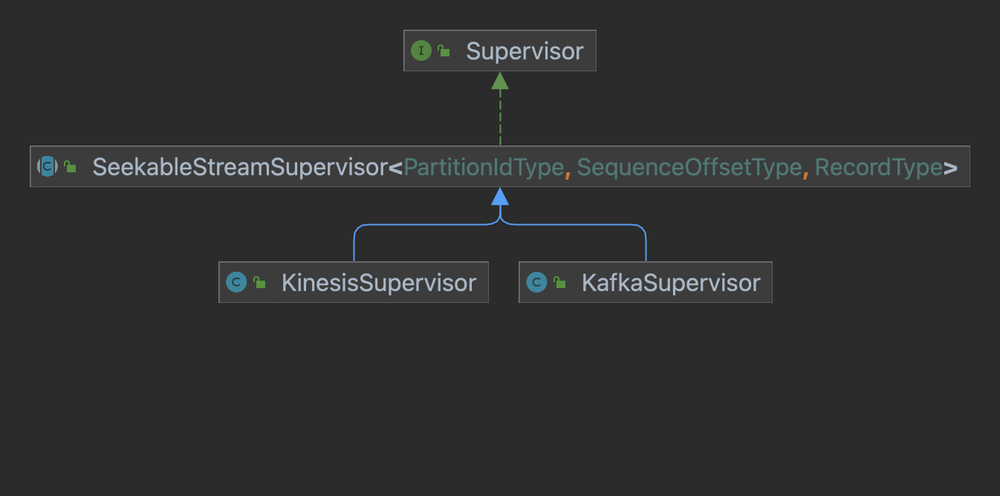
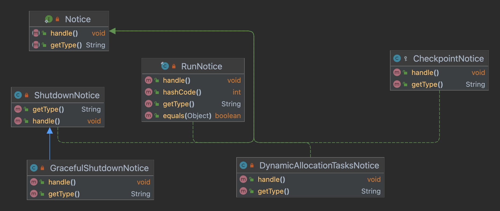

# Streaming

## Supervisor



`supervisor` 在 `Overlord` 上配置，管理一个 `datasSource` 的流式摄取，更新流的分区信息，创建任务保证流的所有分区都被消费。模板类 `SeekableStreamSupervisor` 包含了 `supervisor` 的主要运行逻辑。



`supervisor` 几个重要的内部类：

- `Notice`，`supervisor` 运行逻辑可抽象成 `Notice` 加入队列，运行过程中从队列取出 `Notice` 依次执行。`supervisor` 启动后会创建线程定期创建 `RunNotice`，其他类型的 `Notice` ，当调用 `supervisor` 实例的对应的方法 `checkpoint`、`reset` 时会加入队列。

- `TaskGroup`，组织监控流分区和任务的数据结构，每个任务会属于一个 `taskGroup`，一个 `taskGroup` 的所有任务应该读相同的分区，从相同的 `offset` 开始读。如果副本数设置为1，则每个 `taskGroup` 只有一个任务。

  ```java
  private class TaskGroup
  {
    //根据分区数和taskCount计算
    final int groupId;
    //<partitionId, offset>，根据partitionGroups创建，如果partitionGroups发生变化，该实例会被销毁
    final ImmutableMap<PartitionIdType, SequenceOffsetType> startingSequences;
    //保存未过滤的分区，仅用于生成序列名，避免序列名冲突
    final ImmutableMap<PartitionIdType, SequenceOffsetType> unfilteredStartingSequencesForSequenceName;
    //<taskId, taskData>
    final ConcurrentHashMap<String, TaskData> tasks = new ConcurrentHashMap<>();
    //能接受的最小消息时间
    final Optional<DateTime> minimumMessageTime;
    //能接受的最大消息时间
    final Optional<DateTime> maximumMessageTime;
    //指定消费的序列
    final Set<PartitionIdType> exclusiveStartSequenceNumberPartitions;
    //<checkpointId, <partitionId, offset>>
    final TreeMap<Integer, Map<PartitionIdType, SequenceOffsetType>> checkpointSequences = new TreeMap<>();
    final String baseSequenceName;
    //publish的超时事件，任务进入publishing后才会初始化
    DateTime completionTimeout; 
  
    TaskGroup(
        int groupId,
        ImmutableMap<PartitionIdType, SequenceOffsetType> startingSequences,
        @Nullable ImmutableMap<PartitionIdType, SequenceOffsetType> unfilteredStartingSequencesForSequenceName,
        Optional<DateTime> minimumMessageTime,
        Optional<DateTime> maximumMessageTime,
        @Nullable Set<PartitionIdType> exclusiveStartSequenceNumberPartitions
    )
    {
      this(
          groupId,
          startingSequences,
          unfilteredStartingSequencesForSequenceName,
          minimumMessageTime,
          maximumMessageTime,
          exclusiveStartSequenceNumberPartitions,
          generateSequenceName(
              unfilteredStartingSequencesForSequenceName == null
              ? startingSequences
              : unfilteredStartingSequencesForSequenceName,
              minimumMessageTime,
              maximumMessageTime,
              spec.getDataSchema(),
              taskTuningConfig
          )
      );
    }
  
    TaskGroup(
        int groupId,
        ImmutableMap<PartitionIdType, SequenceOffsetType> startingSequences,
        @Nullable ImmutableMap<PartitionIdType, SequenceOffsetType> unfilteredStartingSequencesForSequenceName,
        Optional<DateTime> minimumMessageTime,
        Optional<DateTime> maximumMessageTime,
        Set<PartitionIdType> exclusiveStartSequenceNumberPartitions,
        String baseSequenceName
    )
    {
      this.groupId = groupId;
      this.startingSequences = startingSequences;
      this.unfilteredStartingSequencesForSequenceName = unfilteredStartingSequencesForSequenceName == null
                                                        ? startingSequences
                                                        : unfilteredStartingSequencesForSequenceName;
      this.minimumMessageTime = minimumMessageTime;
      this.maximumMessageTime = maximumMessageTime;
      this.checkpointSequences.put(0, startingSequences);
      this.exclusiveStartSequenceNumberPartitions = exclusiveStartSequenceNumberPartitions != null
                                                    ? exclusiveStartSequenceNumberPartitions
                                                    : Collections.emptySet();
      this.baseSequenceName = baseSequenceName;
    }
  
    //添加新的checkpoint
    int addNewCheckpoint(Map<PartitionIdType, SequenceOffsetType> checkpoint)
    {
      // 序列号加1
      checkpointSequences.put(checkpointSequences.lastKey() + 1, checkpoint);
      return checkpointSequences.lastKey();
    }
  
    Set<String> taskIds()
    {
      return tasks.keySet();
    }
  }
  ```

- `TaskData`：对任务的状态、开始时间、消费到的分区 `offset` 做了封装

  ```java
  private class TaskData
  {
    //任务状态
    volatile TaskStatus status;
    //任务开始时间
    volatile DateTime startTime;
    //任务读取的每个分区的offset，<key:partitionId, value:offset>
    volatile Map<PartitionIdType, SequenceOffsetType> currentSequences = new HashMap<>();
  
    @Override
    public String toString()
    {
      return "TaskData{" +
             "status=" + status +
             ", startTime=" + startTime +
             ", checkpointSequences=" + currentSequences +
             '}';
    }
  }
  ```

`supervisor` 重要的数据结构：

- `activelyReadingTaskGroups`：存储正在读数据的 `taskGroup`，`Map<{group id}, {TaskGroup}>`；
- `pendingCompletionTaskGroups`：存储 `publish` 的 `taskGroup`，`Map<{group id}, {List<TaskGroup>}>`。任务停止读数据，开始 `publish`，会将该 `taskGroup` 从 `activelyReadingTaskGroups` 去除，加入到 `pendingCompletionTaskGroups`；
- `partitionOffsets`：存储当前流消费的每个分区的 `offset`，初始化为-1。若 `taskGroup` 从 `partitionOffsets` 读取到的 `offset `是-1，则从 `metadata` 读取更新 `offset`，`Map<{partition id}, {offset}>`；若消费某组分区的任务失败，`partitionOffsets` 会重置为-1。
- `partitionGroups`：存储 `taskGroup` 分到的分区，`Map<{partition id}, Set<{partition Id}>>`；
- `partitionIds`：`List<PartitionId>`，存储当前发现的该流的分区；
- `notices`：对 `LinkedHashSet` 做了封装，存储待处理的 `Notice`

`RunNotice`，`supervisor` 定期执行的逻辑，过程如下：

- 检查是否需要注册 `listener` 监听任务的状态变化；
- 切换 `supervisor` 状态为 `CONNECTING_TO_STREAM` ，更新流分区， `partitionIds`，`partitionGroups`，`partitionOffsets` 会在这个过程更新。如果分区变化，会给 `earlyStopTime` 赋值，触发停止任务，重新给分区创建任务。如果该  `supervisor` 近期没有成功结束的任务且分区更新失败，该 `RunNotice` 执行结束，否则继续执行下一步；
- 更新分区信息后，`supervisor` 状态切换为 `DISCOVERING_INITIAL_TASKS`，开始发现新任务。从 `metadatadb` 查询该 `dataSource` 活跃的任务，处理缓存中没有的任务，用 `taskClient` 查询这些任务的状态和 `endOffset`，状态是 `publishing`，`endOffset` 才有值，否则为空。如果返回的状态是 `publishing`，添加该任务到 `pendingCompletionTaskGroups`，更新 `partitionOffsets`；如果任务状态不是 `publishing`，检查任务的有效性，即和当前 `supervisor` 的版本是否匹配、分配的分区和 `taskGroupId` 是否匹配，无效的任务之后会等待停止或杀死，有效的任务添加到 `activelyReadingTaskGroups`，并通过 `taskClient` 验证 `checkpoint`。如果是第一次运行，会唤醒 `activelyReadingTaskGroups` 中所有暂停的任务；
- 发现任务后会从 `metadatadb` 更新所有任务状态，用 `taskClient` 更新任务的开始时间。若任务的开始时间未知，杀死这些任务。对于正在读数据的任务，找出每个 `taskGroup` 最晚开始执行的任务，如果该任务的执行时间超过 `taskDuration`，或者流的分区信息发生变化，即 `earlyStopTime` 不为空，则用 `taskClient` 暂停任务，记录这些任务读到的最新的 `offset`，更新 `endOffset`。设置该 `taskGroup` 的 `completionTimeout`，加入 `pendingCompletionTaskGroups`，更新 `partitionOffsets` 为 `endOffset`，开始进行 `publish`；
- 检查 `pendingCompletionTaskGroups`，对一个 `taskGroup`，若有一个任务成功，停止剩下的任务，不需所有任务完成 `publish`。如果 `publish` 超时，超过 `completionTimeout`，杀死该 `taskGroup` 的所有任务，包括 `reading` 的任务，重置 `partitionOffsets` 为-1；
- 检查 `activelyReadingTaskGroups`，移除和 `supervisor` 不匹配、失败的任务，如果有任务成功，停止 `taskGroup` 剩下的任务；
- 检查 `supervisor` 是否配置了 `idleConfig`，若无，状态切为 `RUNNING`，否则切为 `IDLE`；
- 检查 `supervisor` 的状态是否为 `STOPPING`，若是则直接返回，结束 `RunNotice`；
- 若 `supervisor` 状态是 `RUNNING`，切换状态为 `CREATING_TASKS`。先检查 `activelyReadingTaskGroups` 中任务数小于副本数的分区组，如果有活跃的 `taskGroup`，检查 `checkpoint` 和 `metadatadb` 是否一致。遍历所有分区组，如果该分区组没有正在消费数据的 `taskGroup`，则创建，`offset` 从 `metadatadb` 同步。对每个消费数据的 `taskGroup`，如果任务数小于副本数，则创建。根据 `taskGroup` 的配置创建 `IoConfig` ，创建 `IndexTask` 对象，交给 `TaskQueue` 等待创建，一个 `RunNotice` 就这样执行完毕。

`ResetNotice`，用于封装 `reset` 给定 `supervisor` 的逻辑。`DataSourceMetadata` 可理解为一个 `PO` 对象，封装该 `datasource` 的元数据。执行 `reset` 操作需要传入一个 `DataSourceMetadata` 实例，若传入的实例为空，会 `reset` 所有的元数据，杀死所有消费数据的任务，即 `activelyReadingTaskGroups` 里的任务，清空所有缓存。若传入的实例不为空，先判断传入的 `DataSourceMetadata` 实例是否满足 `reset` 的要求，从 `metadatadb` 查询得到 `DataSourceMetadata` 实例，和传入的实例比较 `offset` 是否相同，相同则更新元数据，执行 `reset`，只保留 `metadatadb` 有但传入的实例没有的分区。更新完 `metadatadb`，移除消费 `reset` 的 `DataSourceMetadata` 分区的所有 `taskGroup` 缓存。

`CheckpointNotice`，封装 `checkpoint` 的逻辑。必须是正在消费数据的 `taskGroup` 才能做 `checkpoint`。做 `checkpoint` 前遍历 `taskGroup` 保存的所有 `checkpoint`，找出和传入的 `SeekableStreamDataSourceMetadata` 一致的那一个，如果和最新的 `checkpoint` 一致，添加 `checkpoint` 到 `taskGroup`。

## TaskQueue

任务生产者，如 `supervisor` 调用 `taskQueue` 的 `add` 方法添加任务。新增的任务先添加到 `metadatadb`，申请锁。`tasks` 集合会定期从 `metadatadb` 同步，没有创建 `future` 的任务会会交给 `taskRunner` 执行，任务完成后会调用回调函数，更新任务在 `metadatadb` 的状态，`taskRunner` 停止任务后更新缓存，释放锁。每当有任务完成，`taskQueue` 会记录总体的任务完成情况，如总的成功任务数、失败任务数等，并暴露方法获取。

重要的成员变量：

```java
//从metadatadb同步的时候更新
@GuardedBy("giant")
private final LinkedHashMap<String, Task> tasks = new LinkedHashMap<>();

//未完成的任务的future
@GuardedBy("giant")
private final Map<String, ListenableFuture<TaskStatus>> taskFutures = new HashMap<>();

//记录已完成的任务，任务标记完成后先存在这，做其他操作忽略该集合中的任务
@GuardedBy("giant")
private final Set<String> recentlyCompletedTasks = new HashSet<>();

//避免对taskQueue频繁的请求
private final BlockingQueue<Object> managementMayBeNecessary = new ArrayBlockingQueue<>(8);

//taskQueue初始化时启动，执行主循环
private final ExecutorService managerExec = Executors.newSingleThreadExecutor(
    new ThreadFactoryBuilder()
        .setDaemon(false)
        .setNameFormat("TaskQueue-Manager").build()
);

//定期从metadatadb同步任务
private final ScheduledExecutorService storageSyncExec = Executors.newSingleThreadScheduledExecutor(
    new ThreadFactoryBuilder()
        .setDaemon(false)
        .setNameFormat("TaskQueue-StorageSync").build()
);


```

## TaskRunner

主要职责是分配任务给 `worker`。

### RemoteTaskRunner

用 `zk` 跟踪 `worker` 运行的任务，通过在 `zk` 上创建临时节点宣布任务的状态。

## TaskLock

`Druid` 的锁和版本紧密耦合，以保证摄取数据的正确性。`Druid` 有两种类型的锁，时间块锁和段锁。任务申请到时间块锁，在生成该时间段的块钱，其他任务都不能生成该时间块的段。申请到时间块锁生成的段比现有的段大版本要大，小版本总是0。任务申请到段锁，多个任务能同时为同一个时间块创建段，如果它们读不同的段。段锁只支持流摄取，不支持批摄取。


### TaskLockBox

记录活跃的任务锁定了哪些 `interval` 或 `segment`，负责分配 `segmentId`，当任务申请一个新的 `segment` 的锁，还涉及到版本分配。每个 `segment` 有一个大版本和小版本，大版本用时间戳表示，小版本用整数表示。

